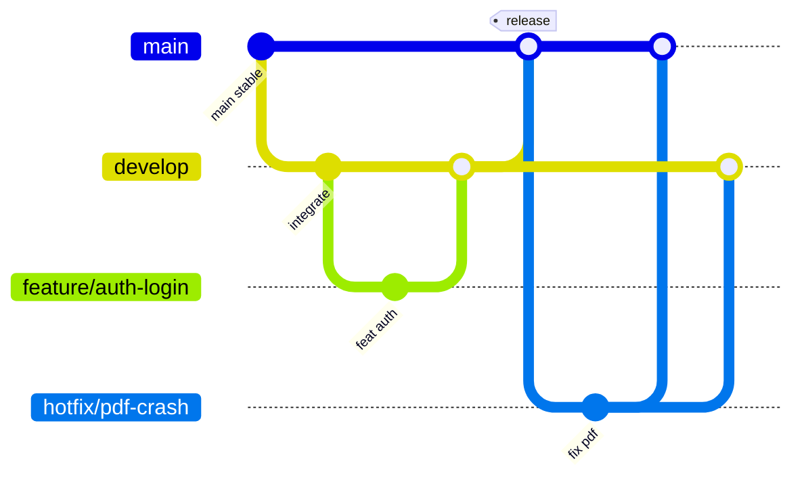

# Referência — Git branching

## Diagrama



## Mapeamento prefix × Conventional Commit

| Branch prefix | Commit `type` usual |
|---------------|---------------------|
| `feature/` | `feat` |
| `fix/` | `fix` |
| `hotfix/` | `fix` |
| `docs/` | `docs` |
| `chore/` | `chore`, `build`, `ci` |

Branch name e commit message **complementam** — não precisam ser idênticos.

---

## Escopos no nome da branch

| Escopo | Uso |
|--------|-----|
| `backend` / `api` | NestJS, Postgres |
| `auth` | RF001–RF003 |
| `patients` | RF004–RF006 |
| `assessments` | RF007–RF011 |
| `instruments` | TUG, Katz, Berg, Tinetti, MEEM |
| `pdf` | RF013 |
| `frontend` / `mobile` | Expo app |
| `contracts` | OpenAPI |
| `cursor` | `.cursor/` |
| `lgpd` | privacy, dados sensíveis |

Ex.: `feature/backend-patient-crud-rf004`, `feature/mobile-berg-form-rf010`.

---

## Pull Request (quando usar `gh`)

Título PR em inglês, alinhado ao commit:

```
feat(auth): implement login screen RF002
```

Base PR:

| Branch origem | Base |
|---------------|------|
| `feature/*`, `fix/*`, `docs/*`, `chore/*` | `develop` |
| `hotfix/*` | `main` (e backport para `develop`) |

---

## Atualizar branch feature com develop

Preferir **rebase** se usuário pedir histórico linear; **merge** se pedir preservar merges.

```bash
rtk git fetch origin
rtk git checkout feature/<name>
rtk git rebase origin/develop
# ou: rtk git merge origin/develop
```

Conflito: resolver, `rtk git add`, continuar rebase/merge; **não** force push em branch compartilhada sem pedido.

---

## Limpar branches locais (opcional)

```bash
rtk git branch -d feature/<name>
rtk git fetch origin --prune
```

---

## Monorepo futuro (`backend/` + `frontend/`)

Mesma política de branches — o **prefixo no nome** indica área:

- `feature/backend-finalize-assessment`
- `feature/mobile-assessment-wizard`
- `feature/backend-finalize-assessment` + `feature/mobile-assessment-wizard` em paralelo, ambos → `develop`

Evitar branch única longa cruzando API + app por semanas — alinha com [repository-and-workflow.md](../../../docs/engineering/repository-and-workflow.md) §2.

---

## LGPD e branches

Telas/dados sensíveis: branch não dispensa rule **`lgpd-sensitive-data-review`** antes de merge.

---

## Estado atual do repo (referência)

Enquanto só existir **`main`**, criar **`develop`** uma vez antes do fluxo feature (ver SKILL.md § “Com develop ainda inexistente”).
