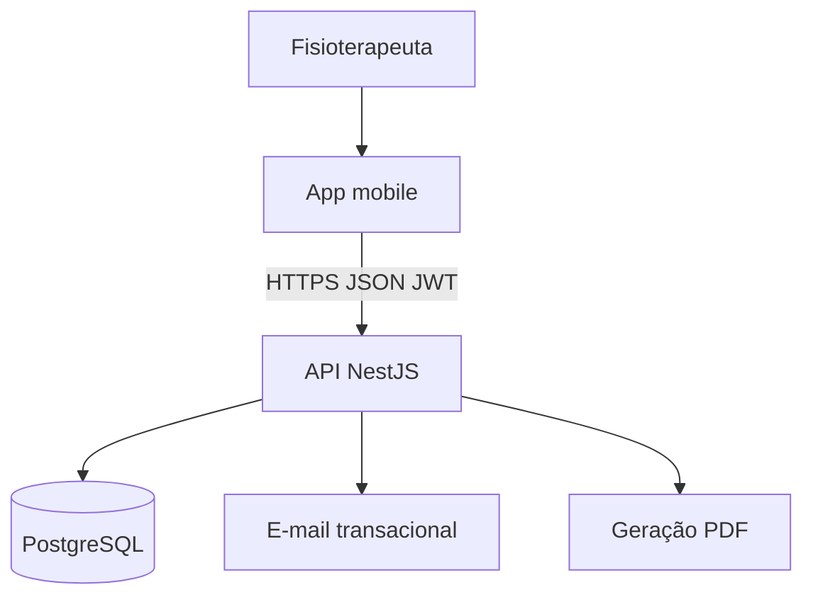
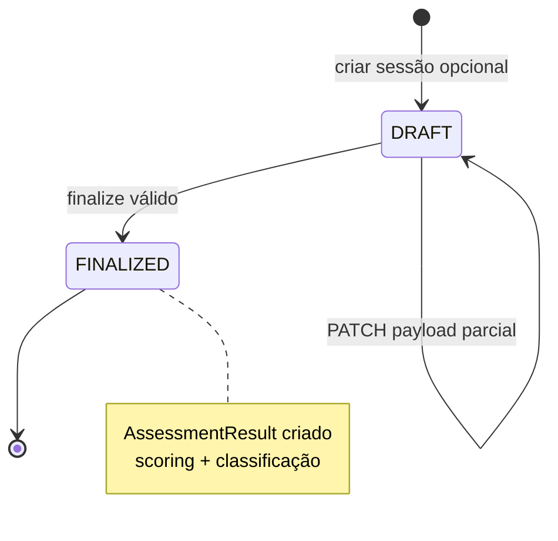

# Backend — documentação de arquitetura

> **Só documentação** em `docs/backend/`. Explica **contexto do produto**, **stack com porquês**, **como a API deve se comportar**, **dados**, **segurança/LGPD** e **limites**. Implementação prevista em `backend/` (monorepo).  
> **Status:** especificação **fechada para Fases B–C** (RF001–RF013 + Prisma + OpenAPI). Implementação do backend **após** telas principais no app (Fase A) — ver [repository-and-workflow](../engineering/repository-and-workflow.md).

**Leitura relacionada:** [frontend](../frontend/README.md) (app) · [architecture](../engineering/architecture.md) (visão global) · [requirements](../product/requirements.md) (RFs) · [PRD](../product/PRD.md) (visão de produto).

---

## Índice

1. [Contexto do produto](#1-contexto-do-produto)  
2. [Papel do backend no ecossistema](#2-papel-do-backend-no-ecossistema)  
3. [Stack oficial e porquês](#3-stack-oficial-e-porquês)  
4. [Como a API deve funcionar](#4-como-a-api-deve-funcionar)  
5. [Instrumentos e regras de cálculo](#5-instrumentos-e-regras-de-cálculo)  
6. [Dados, modelo e persistência](#6-dados-modelo-e-persistência)  
7. [Segurança, LGPD e confidencialidade](#7-segurança-lgpd-e-confidencialidade)  
8. [Contratos, erros e evolução](#8-contratos-erros-e-evolução)  
9. [Organização em módulos](#9-organização-em-módulos)  
10. [Anti-padrões](#10-anti-padrões)  
11. [Entrega por fases](#11-entrega-por-fases)

---

## 1. Contexto do produto

O **Sênior Teste Funcional** nasce de um problema concreto na fisioterapia geriátrica: o acompanhamento funcional do idoso costuma ficar **disperso** (papel, planilhas, memória), **difícil de comparar no tempo** e **pouco rastreável** quanto ao protocolo e aos critérios usados em cada sessão ([PRD](../product/PRD.md)).

A plataforma digitaliza esse fluxo para o **fisioterapeuta** (persona principal):

- Cadastra pacientes e aplica **cinco instrumentos** padronizados no MVP: **TUG, Katz, Berg, Tinetti, MEEM**.  
- Consulta **histórico** e **evolução** por instrumento.  
- Gera **PDF** por avaliação/instrumento para arquivo ou entrega assistencial.  

O backend entra como a camada que **garante que dois profissionais, dois celulares ou duas versões do app não produzam resultados divergentes** para a mesma entrada de dados — e que **dados sensíveis de saúde** fiquem sob controle técnico adequado ([privacy-and-lgpd](../product/privacy-and-lgpd.md)).

**Importante:** o sistema **apoia** a decisão clínica; **não substitui** o julgamento do profissional. A API automatiza cálculo e classificação **quando há tabela parametrizada**, mas o texto de conduta na cadeira do paciente continua em [clinical-protocols](../clinical-protocols/README.md).

---

## 2. Papel do backend no ecossistema

### 2.1 Definição em uma frase

O backend é o **servidor HTTP (API REST)** — **única fonte da verdade** para regras de negócio, persistência, permissões, PDF e e-mail transacional.

### 2.2 O que o app faz vs o que o servidor faz

| Atividade | App mobile | API (backend) |
|-----------|------------|---------------|
| Mostrar formulário Berg item a item | Sim | Não |
| Validar “campo obrigatório vazio” na UX | Sim | Também (Zod) — defesa em profundidade |
| Calcular soma Berg / estrato Katz | **Não** (oficial) | **Sim** |
| Decidir corte MEEM por escolaridade | **Não** | **Sim** |
| Gravar histórico consultável anos depois | Indireto (via API) | **Sim** (Postgres) |
| Gerar PDF A4 com gráfico | Exibe/baixa | **Gera** |
| Enviar e-mail “esqueci senha” | Dispara pedido | **Envia** (provedor SMTP/API) |
| Impedir fisio A de ver paciente do fisio B | Não confiar só no app | **Sim** (JWT + query) |

### 2.3 Diagrama de contexto



### 2.4 Por que centralizar no servidor (não “API leve + lógica no app”)

1. **Integridade clínica documental** — Se o Katz mudar a regra de estrato na versão 2, atualiza-se **um** serviço de scoring; não é necessário republicar app na loja para corrigir cálculo.  
2. **Relatório PDF** — Layout A4, cabeçalho, gráfico e texto de interpretação devem ser **idênticos** independentemente de iPhone ou Android.  
3. **LGPD e auditoria** — Dados de saúde com trilha em banco controlado; menos cópias “oficiais” espalhadas no dispositivo.  
4. **Concorrência** — Dois dispositivos do mesmo profissional (futuro) ou reabertura de sessão ficam coerentes se o estado vive no servidor (rascunho opcional).  
5. **Contrato explícito** — OpenAPI permite validar app, testes e integrações futuras (ex.: prontuário) contra o mesmo comportamento.

---

## 3. Stack oficial e porquês

### 3.1 Tabela resumida

| Tecnologia | Papel | Por que esta escolha (e não outra) |
|------------|-------|-------------------------------------|
| **Node.js LTS** | Runtime da API | Mesmo ecossistema TypeScript do app; bibliotecas maduras para HTTP, PDF e e-mail; equipe full-stack não divide linguagem |
| **NestJS** | Framework | Estrutura **por módulos** espelha domínio (auth, patients, assessments); guards/pipes para JWT e validação; Swagger nativo — reduz “arquivo único gigante” em projetos com 13+ RFs |
| **TypeScript** | Tipagem | Contratos alinhados ao Prisma e ao app; refatoração mais segura quando RF010 cresce por instrumento |
| **PostgreSQL** | Banco relacional | FKs fisio→paciente→avaliação; transações; séries temporais por data; **JSONB** para payloads diferentes sem 5 bancos NoSQL |
| **Prisma** | ORM + migrações | Schema versionado em Git; `prisma migrate` reproduz ambiente; tipos gerados batem com [data-model](../engineering/data-model.md) |
| **Zod** | Validação de entrada | Schema distinto por `instrument_code` (TUG tem 3 floats, Berg tem 14 inteiros); mensagens de erro consistentes; pode virar pacote compartilhado com o app |
| **JWT** | Autenticação stateless | Padrão para mobile: cada request leva Bearer; API horizontalmente escalável sem sessão em memória (refresh token em evolução) |
| **Argon2id** / bcrypt | Hash de senha | RF001 exige armazenamento seguro; Argon2id resiste melhor a GPU que MD5/SHA legados |
| **OpenAPI 3** | Contrato público | Documentação viva em `/api/docs`; base para codegen do frontend e testes de contrato |
| **Provedor e-mail** (Resend, SES…) | RF003 | App não guarda credencial SMTP; servidor controla template, TTL e invalidação do token |
| **Biblioteca PDF no Node** | RF013 | Servidor monta A4 com identidade, resultado, interpretação e gráfico opcional |

### 3.2 PostgreSQL em profundidade

O domínio **não é** “documentos soltos de avaliação”. É uma árvore estável:

```
Therapist (1) ──► (N) Patient ──► (N) Assessment ──► (0..1) AssessmentResult
                      │                    │
                      │                    └──► Instrument (catálogo fixo MVP)
```

**Por que não MongoDB?** Relações e integridade importam: apagar paciente não pode deixar avaliação órfã; finalizar avaliação exige **transação** que grava payload + resultado + timestamp. Agregações para gráfico (RF012) são SQL natural (`ORDER BY finalized_at`).

**Por que JSONB no `payload`?** Os cinco instrumentos têm **formas diferentes** (tempos vs 14 itens vs blocos MEEM). Modelar 40 tabelas filhas no dia 1 atrasa o MVP; JSONB + Zod no serviço dá flexibilidade **com validação estrita**. Se no futuro um instrumento exigir BI pesado, extrai-se tabelas físicas só para ele.

**Por que não Firebase/Supabase como “backend completo”?** Regras de scoring ficariam em Cloud Functions ou no cliente; PDF e isolamento por `therapist_id` ficam menos transparentes no repositório de especificação; auditoria institucional costuma preferir API explícita + Postgres dedicado.

### 3.3 Monólito NestJS (uma API, um deploy)

Para o MVP e equipes pequenas: **um** processo, **um** banco, **um** OpenAPI. Custo operacional mínimo. Microsserviços (“auth service”, “pdf service”) só se houver escala ou times separados — senão adicionam latência de rede e complexidade de deploy sem ganho proporcional.

### 3.4 Toolchain quando houver código

Previsto: monorepo com **Bun** ou npm workspaces separando pasta de implementação da API e do app ([architecture](../engineering/architecture.md)). Este repositório atual é **só docs**; a stack acima vale para onde o código for versionado.

---

## 4. Como a API deve funcionar

### 4.1 Princípios operacionais (não negociáveis)

| # | Princípio | Implicação prática |
|---|-----------|-------------------|
| 1 | **Autorização no servidor** | Extrair `therapistId` do JWT; toda query de paciente/avaliação inclui esse filtro |
| 2 | **Não confiar no cliente** | `patientId` no body é sugestão; o serviço confirma posse antes de ler/escrever |
| 3 | **Scoring no finalize** | PATCH pode salvar rascunho; `AssessmentResult` nasce no fechamento com regra completa |
| 4 | **Um motor por instrumento** | Pastas `tug`, `katz`, … evitam `if (tipo === 'berg')` espalhado |
| 5 | **Contrato antes do app** | Mudou JSON ou regra → OpenAPI + comunicação; app segue servidor |
| 6 | **PDF e e-mail só aqui** | Evita duplicidade iOS/Android e vazamento de credencial de mail no APK |

### 4.2 Jornada do profissional (visão API)

Exemplo narrativo — **Maria**, fisioterapeuta:

1. **Registro/login (RF001–RF002)** — API cria `Therapist`, guarda hash; login devolve JWT.  
2. **Cadastra paciente João (RF004)** — `POST /patients` com `therapist_id` implícito do token.  
3. **Lista pacientes (RF005)** — `GET /patients?search=joão`; só retorna pacientes de Maria.  
4. **Nova avaliação TUG (RF007–RF011)** — Escolhe instrumento e paciente no app; API pode criar `Assessment` DRAFT; app envia tempos; `finalize` calcula média, classificação, persiste `AssessmentResult`.  
5. **Segunda TUG semanas depois** — Novo `finalize`; `GET timeseries` passa a ter 2 pontos → app e PDF podem mostrar gráfico.  
6. **PDF (RF013)** — `POST /reports/...` gera arquivo com resultado + gráfico se couber.  

Se **Carlos**, outro fisio, tentar `GET /patients/{idDeJoão}` com token dele, a API responde **403/404** — João não pertence a Carlos.

### 4.3 Ciclo de vida de uma avaliação



- **DRAFT:** permite retomar coleta se o app fechar (evolução desejável; não obrigatória no primeiro corte de RF).  
- **FINALIZED:** imutável para fins de scoring oficial (correções futuras = nova avaliação ou política institucional de retificação, fora do MVP).

### 4.4 Endpoints por área (mapa mental)

**Autenticação — RF001–RF003**

| Método | Rota (exemplo) | Comportamento esperado |
|--------|----------------|------------------------|
| POST | `/auth/register` | E-mail único; validação de senha; hash Argon2id |
| POST | `/auth/login` | Retorna access token; mensagem genérica se falhar (não vazar se e-mail existe) |
| POST | `/auth/forgot-password` | Gera token **6 dígitos**, TTL **10 min**, hash no banco, dispara e-mail |
| POST | `/auth/reset-password` | Valida token; troca senha; **invalida** token usado |

**Pacientes — RF004–RF006**

| Método | Rota (exemplo) | Comportamento esperado |
|--------|----------------|------------------------|
| POST/PUT | `/patients` | CRUD com validação de campos; escolaridade recomendada para MEEM |
| GET | `/patients` | Lista paginada, busca por nome, ordenação; **sempre** escopo do token |
| GET | `/patients/:id` | Perfil + histórico de avaliações (resumo por instrumento) |
| GET | `/patients/:id/assessments/:assessmentId` | Detalhe de uma sessão (para tela de detalhe RF006) |

**Instrumentos — RF007**

| Método | Rota | Comportamento |
|--------|------|---------------|
| GET | `/instruments` | Cinco registros seed; ordem **alfabética** por nome; campo `authors` obrigatório |

**Avaliações — RF008–RF011**

| Método | Rota | Comportamento |
|--------|------|---------------|
| POST | `/assessments/draft` | Cria linha com `instrument_code`, `patient_id`, valida posse |
| PATCH | `/assessments/:id` | Atualiza `payload` parcial se ainda DRAFT |
| POST | `/assessments/:id/finalize` | Zod → scoring → `AssessmentResult` → status FINALIZED |

**Evolução e relatório — RF012–RF013**

| Método | Rota | Comportamento |
|--------|------|---------------|
| GET | `/patients/:id/instruments/:code/timeseries` | Array cronológico; vazio ou 1 ponto = app mostra mensagem sem gráfico |
| POST | `/reports/assessments/:assessmentId` | PDF A4; inclui gráfico só se ≥ 2 avaliações **do mesmo** `code` |

Ordem das telas no app: instrumento → paciente → tutorial → coleta ([requirements](../product/requirements.md)); a API **não impõe ordem HTTP**, mas exige vínculos coerentes no `finalize`.

### 4.5 Regras de produto refletidas na API

| Regra de negócio | Comportamento no servidor |
|------------------|---------------------------|
| Gráfico só com ≥ 2 do **mesmo** instrumento | `timeseries` e PDF verificam `instrument_code` + `patient_id` |
| Sem PDF “todos os testes juntos” | Não existe endpoint agregador multi-instrumento no MVP |
| MEEM: escolaridade efetiva na sessão | Persistir `schooling_band_used` na `Assessment` |
| Katz: estrato por contagem de **D** | Serviço `katz` implementa regra do projeto (ver clinical-protocols) |
| Comparativo com última avaliação | `finalize` pode retornar `delta` em relação à anterior do mesmo código |

---

## 5. Instrumentos e regras de cálculo

Cada instrumento é um **subdomínio**. O aplicador segue [clinical-protocols](../clinical-protocols/instruments/); o servidor implementa **o que entra no banco e no PDF**.

| Código | O que o app coleta (resumo) | O que o servidor calcula | Nuance importante |
|--------|----------------------------|--------------------------|-------------------|
| **TUG** | 3 tempos em segundos | **Média** aritmética | Ensaio de familiarização pode existir na conduta clínica; o RF fala nos 3 tempos reais — alinhar payload ao protocolo adotado |
| **KATZ** | 6 domínios: I / A / D | Estrato **0–6** = quantidade de **D** | Opção **A** entra na coleta e no relatório descritivo; estrato numérico segue contagem de D ([katz/assess](../clinical-protocols/instruments/katz/assess.md)) |
| **BERG** | 14 itens, nota 0–4 cada | **Soma** 0–56 | Validação: nenhum item vazio no finalize |
| **TINETTI** | 16 itens (equilíbrio + marcha) | **Soma** 0–28 | Progresso “item X de 16” é UX do app |
| **MEEM** | Blocos com tetos (total 30) | **Soma** + **faixa** por escolaridade | Usar `schooling_band_used` da sessão; não confiar só no cadastro se houve correção na aplicação |

**Classificação parametrizada (cores/texto):** tabelas versionadas em `scoring-rules` (ex.: TUG &lt; 10 s “bom” em contexto de triagem — valores podem ser parametrizados após homologação clínica). Se não houver tabela, RF011 ainda retorna **resultado bruto** sem interpretação automática.

**Cortes MEEM (Brucki et al.):** mudança de tabela é motivo para versionar `scoring-rules` e registrar changelog — não alterar silenciosamente resultados antigos sem política de retificação.

---

## 6. Dados, modelo e persistência

Documento ER: [data-model](../engineering/data-model.md).

### 6.1 Entidades principais

| Entidade | Por que existe |
|----------|----------------|
| `Therapist` | Conta do fisio; âncora de isolamento multi-tenant “leve” (um profissional não vê dados de outro) |
| `Patient` | Titular dos dados clínicos; `therapist_id` obrigatório |
| `Instrument` | Catálogo estável dos 5 códigos; autores para PDF e RF007 |
| `Assessment` | Uma sessão de aplicação; `payload` JSONB enquanto coleta |
| `AssessmentResult` | Snapshot do resultado **oficial** pós-finalize |
| `PasswordResetToken` | RF003 sem guardar token em claro |

### 6.2 Índices e performance (contexto)

- Lista de pacientes por fisio + busca por nome → índice em `(therapist_id, full_name)`.  
- Série temporal → `(patient_id, instrument_code, finalized_at DESC)`.  
- Rascunhos antigos (limpeza futura) → índice em `status`.  

Volume esperado no MVP (consultório / disciplina acadêmica) não exige sharding; Postgres gerenciado com backup basta.

### 6.3 Retenção e exclusão (LGPD)

Prazos e pedidos de exclusão são decisão do **controlador** ([privacy-and-lgpd](../product/privacy-and-lgpd.md)). Tecnicamente, a API deve permitir evolução para:

- exclusão lógica de paciente;  
- exportação estruturada se o controlador pedir portabilidade;  
- minimização de logs com dado clínico em texto claro.

---

## 7. Segurança, LGPD e confidencialidade

### 7.1 Dados sensíveis

Resultados de TUG, Katz, Berg, Tinetti e MEEM são **dados sobre saúde** no contexto do produto. Identificação de paciente e profissional são dados pessoais. A API deve:

- HTTPS obrigatório em produção;  
- não logar `payload` completo em INFO (usar nível restrito ou mascaramento);  
- não expor stack trace ao app em produção.

### 7.2 Isolamento multi-profissional

```text
Request → Guard JWT → extrai therapistId
         → Service → WHERE therapist_id = :therapistId
```

Cenário de teste obrigatório: token do fisio A + `patientId` do fisio B → **falha**.

### 7.3 E-mail e PDF

- E-mail: só metadados mínimos no provedor; template sem dados clínicos desnecessários no reset de senha.  
- PDF: amarrado a `assessmentId` + dono; não gerar PDF de avaliação alheia.

Mais marcos: [privacy-and-lgpd](../product/privacy-and-lgpd.md).

---

## 8. Contratos, erros e evolução

### 8.1 OpenAPI

- Fonte viva gerada pelo Nest (Swagger).  
- Snapshots opcionais em [contracts](../contracts/README.md) por tag de release (`v0.1.0`).  
- Campos e enums nomeados de forma estável (`instrument_code`, não `type` genérico).

### 8.2 Formato de erro (recomendação)

Respostas JSON consistentes, por exemplo:

```json
{
  "statusCode": 400,
  "message": "Payload inválido para instrumento BERG",
  "details": [{ "path": "item3", "issue": "required" }]
}
```

Evita o app tratar HTML de erro 500 como JSON.

### 8.3 Versionamento de regras clínicas

Tabelas de corte com `versionTag` (ex.: `tug-cutoff-2026-01`). Avaliação finalizada guarda qual versão foi aplicada (`classification_meta` JSON), para explicar divergência histórica se a tabela mudar.

---

## 9. Organização em módulos

```
backend/src/
├── prisma/                 # PrismaService
├── health/
├── auth/                   # RF001–RF003: registro, login, reset
├── therapists/             # perfil do profissional autenticado
├── patients/               # RF004–RF006
├── instruments/            # RF007 catálogo (seed 5 códigos)
├── assessments/
│   ├── assessments.controller.ts
│   ├── assessments.service.ts
│   └── instruments/
│       ├── tug/            # schema Zod + score() + classify()
│       ├── katz/
│       ├── berg/
│       ├── tinetti/
│       └── meem/
├── scoring-rules/          # tabelas de corte versionadas
├── reports/                # RF013 PDF
└── notifications/          # RF003 e-mail transacional
```

**Convenção `instrument_code`:** valores persistidos e expostos na API em **MAIÚSCULAS** (`TUG`, `KATZ`, …); pastas de código e segmentos de URL em **minúsculas** (`tug`, `katz`, …). Detalhe: [data-model §1.1](../engineering/data-model.md).

Cada pasta `instruments/*` contém: **schema Zod**, **função score()**, **função classify()** opcional — testável unitariamente sem HTTP.

---

## 10. Anti-padrões

| Anti-padrão | Por que evitar |
|-------------|----------------|
| Calcular Katz/MEEM no app “também, para preview” | Diverge do PDF e do histórico oficial |
| GraphQL só por moda | RFs mapeiam bem em REST; OpenAPI mais simples para equipe e disciplina |
| `patientId` sem checagem de posse | Vazamento entre profissionais |
| Um JSON `assessment` opaco sem Zod | Bugs silenciosos em produção |
| PDF gerado no cliente | Layout diferente por plataforma |
| Relatório único com 5 instrumentos | Fora do escopo acordado; confunde leitura clínica |
| Logar senha ou token de reset | Violação grave de segurança |

---

## 11. Entrega por fases

Ordem macro do projeto: **frontend (Fase A) → backend (B–C) → integração (D)** — [repository-and-workflow](../engineering/repository-and-workflow.md) §3.

| Fase | Foco backend | Critério de “pronto” |
|------|--------------|----------------------|
| **B** | Auth + pacientes + Prisma + OpenAPI | Postman/Insomnia executa RF001–RF005 sem app |
| **C** | 5 instrumentos + timeseries + PDF | RF007–RF013 verificáveis por contrato; ordem sugerida: **TUG → Katz → Berg → Tinetti → MEEM** |

A **Fase D** (app consumindo esta API) substitui os mocks implementados na Fase A do frontend.

Detalhe cronológico: [repository-and-workflow](../engineering/repository-and-workflow.md).

---

## Referências

- [../engineering/architecture.md](../engineering/architecture.md)  
- [../engineering/data-model.md](../engineering/data-model.md)  
- [../product/requirements.md](../product/requirements.md)  
- [../product/PRD.md](../product/PRD.md)  
- [../product/privacy-and-lgpd.md](../product/privacy-and-lgpd.md)  
- [../frontend/README.md](../frontend/README.md)
