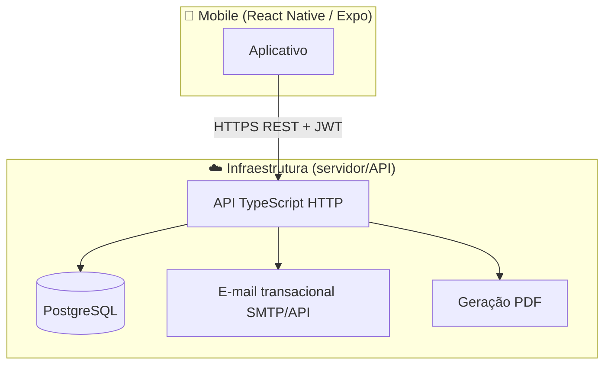

# Arquitetura planejada — Sênior Teste Funcional

**Público:** engenharia da aplicação, produto técnico e consultores externos que necessitem alinhar implementação aos requisitos.  
**Restrições de produto:** aplicativo mobile como canal principal da experiência descrita na PRD, instrumentos funcionais padronizados (TUG, Katz, Berg, Tinetti, MEEM), histórico longitudinal, relatórios, recuperação de senha por canal **eletrônico** autorizado pela API e segregação estrita dos dados por fisioterapeuta.  
**Restrições técnicas declaradas:** cliente em **React Native**; adoção recomendável de **TypeScript** cliente e servidor.

Este documento descreve decisões estruturais para **segurança, manutenção e escalabilidade operacional dentro do modelo de monólito bem delimitado** adotado no repositório. Está alinhado aos arquivos [PRD.md](../produto/PRD.md), [levantamento-requisitos.md](../produto/levantamento-requisitos.md), [privacidade-e-lgpd.md](../produto/privacidade-e-lgpd.md); não os substitui.

Para ordenação das fases **A→E** (implementação primeiro no `backend/` com contrato explícito, seguido de cliente com prioridade nos fluxos de negócio, e refinamentos de apresentação), ver **[repositorio-e-fluxo-desenvolvimento.md](./repositorio-e-fluxo-desenvolvimento.md)**.

---

## 1. Princípios diretores

| Princípio | O que significa aqui |
|-----------|---------------------|
| **Backend é fonte da verdade** | Pontuações, cortes parametrizados, permissão (“só meus pacientes”), PDF estável — tudo validado/persistido no servidor. |
| **Monólito primeiro** | Uma API, um banco — evita dispersão operacional até existir dor real de escala. |
| **TypeScript ponta a ponta** | Reduz inconsistência entre cliente consumidor da API e o servidor gerador das regras; tipos explícitos e contratos formais ficam próximos do código-fonte dos dois tiers. |
| **Domínio explícito por instrumentos** | TUG/Katz/Berg/Tinetti/MEEM têm modelos diferentes — separar por módulos/pastas, não uma “mega entidade AvaliacaoGenérica”. |
| **PDF e e-mail no servidor** | Comportamento previsível e layout A4 igual em todos os celulares. |

---

## 2. Visão de alto nível (C4 simplificado)



**Cliente:** apenas consome APIs; armazena localmente só **tokens** e **cache de leitura** (opcional), nunca autoridade sobre regras de negócio clínicas.

---

## 3. Stack técnica sugerida (TypeScript ponta a ponta)

### 3.1 Cliente mobile

| Peça | Escolha sugerida | Motivo |
|------|-----------------|--------|
| Framework | **Expo + React Native** | Ciclo produtivo e empacotamento alinhados a equipes enxutas; integração forte com toolchain moderna (`EAS`). |
| Navegação | **React Navigation** | Padrão de mercado, boa comunidade. |
| Estado servidor | **TanStack Query (React Query)** | Lista de pacientes, histórico, invalidação por mutação — reduz código manual em vistas baseadas nos mesmos padrões de fetch. |
| Estado local leve | **Zustand** ou contexto bem pequeno | Fluxo wizard (instrumento → paciente → tutorial → execução) sem Redux pesado. |
| Formulários | **React Hook Form + Zod** | Validações alinhadas ao que o backend já valida (`zod`). |
| Auth em dispositivo | **expo-secure-store** (ou equivalente) | Guardar access/refresh ou sessão sem plain-text em AsyncStorage livre. |
| HTTP | **fetch ou ky** centralizado em um cliente com interceptadores | Injeta Bearer, tratamento de 401/conflito básico. |

**Bare React Native:** considerável apenas quando houver bibliotecas ou requisitos de plataforma que o ciclo oficial do Expo não atenda nos prazos do produto atual (cenário incomum dentro do PRD atual).

### 3.2 Backend (API)

| Peça | Escolha principal | Alternativa más leve |
|------|-------------------|----------------------|
| Runtime | **Node.js LTS** | Idem |
| Framework | **NestJS** — módulos por domínio (auth, therapists, patients, assessments, instruments) | **Fastify + @fastify/jwt + plugins próprios** — menos estrutura, mais manual |
| ORM | **Prisma + PostgreSQL** | **Drizzle** — mesmo espírito, SQL mais próximo |

**Por que NestJS + Prisma costumam compor bem o tier da API:**

- Estrutura orientada **módulos** e injeção de dependência localiza políticas (`guards`), validação (`pipes`) e serviços de domínio em pastas estáveis sob crescimento paralelo das rotas REST.
- **Prisma**: migrações versionadas (`prisma migrate`), tipagem gerada e DDL explícito alinham bem com evoluções do schema relacionais e com contratos externos (OpenAPI/TS cliente).
- A **camada REST + esquema de payloads claro** permite, se necessário, substituir o framework HTTP sem obrigar retrabalhar o aplicativo cliente além das rotas tocadas — desde que semver e especificação pública continuem sendo respeitados.

### 3.3 Banco de dados

**PostgreSQL** em ambiente hospedado (Neon, Supabase só como Postgres, RDS, Railway, Render, Fly — qualquer um que você preferir mantendo backup simples).

### 3.4 PDF

| Abordagem | Quando usar |
|-----------|--------------|
| **Servidor gerando PDF** (recomendado) — ex.: `@react-pdf/renderer` no Node, Puppeteer/Chromium para HTML→PDF ou bibliotecas tipo PDFKit templates | MVP alinhado à PRD: layout A4 idêntico, assinatura/carimbo, gráficos reproduzíveis |
| Cliente só gera arquivo “local” sem servidor | Mais risco de divergência iOS/Android e mais trabalho sua em dupla manutenção |

### 3.5 E-mail (recuperação de senha)

Provedores transacionais com API simples (ex.: **Resend**, AWS SES via SMTP/API, SendGrid — escolha por custo/região). O app não envia e-mail; só chama a API que agenda o envio.

---

## 4. Organização do repositório (decisão do projeto)

Este repositório Git usa pastas explícitas de primeiro nível para facilitar localização rápida do código antes de pacotes opcionais adicionados:

```
/backend           # Implementação inicial da API, Postgres e documentação Swagger/OpenAPI
/frontend          # Cliente Expo — prioridade inicial aos fluxos e às validações funcionais antes de refinamentos cosméticos
/packages          # (Opcional) Tipos/Zod compartilhados entre tiers, lint ou utilidades comuns
/docs              # Produto, engenharia, LGPD, modelo de dados e protocolos de referência
```

Fluxo recomendável de mudanças: primeiro **mudar modelo + endpoints no `backend`** e atualizar contrato (**OpenAPI**); depois ajustar o `frontend` apenas às mensagens já estáveis JSON.

### Monorepo com **Bun** (workspaces)

O fluxo recomendado de toolchain é **Bun** (`bun install`, `bun run`, `bun test`) com **workspaces** declarados na raiz em um `package.json` privado:

```json
{
  "name": "senior-test",
  "private": true,
  "workspaces": ["backend", "frontend", "packages/*"]
}
```

Pastas continuam sendo `backend/` e `frontend/`; use **`packages/`** opcional (ex.: `shared-contracts` com Zod).

- **NestJS:** scripts típicos via `bun run …`; gere o projeto conforme docs do `@nestjs/cli`.  
- **Prisma:** prefira `bunx prisma migrate dev`; se algum comando do CLI falhar por binário específico, use **`npx prisma …`** só naquele passo (exceção pontual).  
- **Expo:** Bun é suportado para criar projeto e gerenciar dependências ([guia Expo + Bun](https://docs.expo.dev/guides/using-bun/)); **EAS Build** permanece igual após configurar `eas.json`.  

Trocar depois por **npm** ou **pnpm** não invalida arquitetura nem as **fases A→E** — só ajuste manifestos e CI.

```
/packages               # Opcional posterior
  /shared-contracts     # Zod + tipos
```

Se preferir não usar monorepo, pode dividir em dois repositórios desde que **`semver + OpenAPI`** continuem explícitos, como em **[repositorio-e-fluxo-desenvolvimento.md](./repositorio-e-fluxo-desenvolvimento.md)**.

---

## 5. Módulos de domínio (API)

Orientação modular alinhada aos RFs e ao fluxo `instrumento → paciente → tutorial → execução → feedback`:

| Módulo | Responsabilidades |
|--------|---------------------|
| **Auth** | Registro/login, hashing (Argon2/bcrypt), JWT access+refresh ou sessão persistida conforme você preferir revisar segurança, recuperação RF003 |
| **Therapists / Users** | Perfil profissional, associações |
| **Patients** | CRUD por `therapistId`, inclusão escolaridade para MEEM |
| **Instrument catalog** | Lista RF007 — metadados (nome, autores), versão textual do tutorial quando não estiver só no cliente |
| **Assessments** | Sessões: qual instrumento, qual paciente, timestamps, payloads por tipo (`tug_sessions`, estruturas Katz/… ou JSON validado strict + colunas pesquisáveis onde fizer sentido) |
| **Scoring rules** | Tabelas de corte parametrizadas (versão/versionTag) aplicadas pelo servidor ao finalizar |
| **Reporting** | Gera PDF, URL assinada temporária ou stream download |
| **Notifications** | Enfileiramento leve ou chamada síncrona ao provedor para token de recuperação |

**MEEM:** persistir sempre `schoolingInterpretationBand` ou similar **na própria linha da avaliação** (valor usado nos cortes após confirmar/corrigir na sessão), conforme especificação do levantamento.

---

## 6. Fluxos relevantes

### 6.1 Autenticação (RF001–RF003)

```
Mobile → POST /auth/login → API valida → retorna tokens
Mobile guarda tokens no Secure Storage
Calls subsequentes: Authorization: Bearer <access>

Refresh + rotação: recomendável para vida longa sem relog frequente — implementar quando já tiver primeira versão usável do resto.
```

Recuperação: `POST /auth/forgot-password` → gera código 6 dígitos, TTL 10 min, invalida uso único conforme RF003.

### 6.2 Nova avaliação (RF007–RF011)

```
GET /instruments          → lista alfabética + autores
POST /assessments/draft   → cria sessão incompleta (opcional mas útil para salvar racional)
PATCH ou PUT por etapa    → persiste payloads parciais (reduz “perdi tudo ao fechar o app”) — opcional MVP
POST /assessments/:id/finalize → servidor recalcula score, aplica cortes, retorna classification

Mobile mostra resultado (RF011) e links para histórico / PDF.
```

Persistência parcial (sessão em edição antes da finalização) **não** é obrigatoriamente especificada no PRD atual; constitui, contudo, **melhora de continuidade** recomendável após o núcleo mínimo de avaliação estar disponível nos ambientes autorizados.

### 6.3 Gráfico (RF012)

API expõe `GET /patients/:id/instruments/:code/timeseries` retornando `[{ date, rawValue, label }]`. O app só desenha (Recharts não roda nativo sem WebView — usar **Victory Native**, **React Native SVG** + próprio, ou libs como `gifted-charts` conforme gosto).

### 6.4 PDF (RF013)

`POST /reports/assessment/:assessmentId` ou `GET` com JWT que gera e devolve arquivo. Opcionalmente grava arquivo em objeto (S3) se quiser reaproveitar o mesmo arquivo — para MVP pode ser só geração on-the-fly.

---

## 7. Segurança, confidencialidade e privacidade (âmbito técnico)

Orientação técnica alinhada à LGPD (Brasil), direitos dos titulares e governança do controlador aparece consolidada em **[privacidade-e-lgpd.md](../produto/privacidade-e-lgpd.md)**. À parte disso:

- Usar HTTPS em produção.  
- Preferir hashing robusto lado servidor (**Argon2id** onde suportado) para senhas.  
- Garantir **escopo obrigatório `therapistId`** inferido ou validado a partir das credenciais — nunca depender apenas de identificadores fornecidos sem checagem de posse pela API.  
- Coleta de **logs** de endereços IP apenas quando indispensável ao incidente/regulamento e sempre com período definido pela política de retenção.  
- Persistir hashes de tokens de recuperação no banco, em linha boas‑práticas de tokens de uso único.

---

## 8. Ambientes e implantação (referência inicial)

| Camada | Diretriz inicial |
|--------|-------------------|
| **API e processos adjacentes leves** | Provedores de PaaS (Railway, Fly.io, Render) ou servidor dedicado, conforme orçamento e exigências de SLA. |
| **PostgreSQL gerenciado** | Instâncias com backup automático — preferencialmente na mesma região e topologia compatível à API, ou através de parceiros com SLA documentado. |
| **Distribuição do aplicativo móvel** | Expo Application Services (**EAS Build**) com canais de testes internos e distribuição pública sempre que política institucional exigir. |
| **CI/CD** | Automatização (ex.: GitHub Actions) quando o fluxo comercial de mudanças justificar regressão contínua; detalhar scripts por workspace assim que cada `package.json` estiver versionado. |

Variáveis de ambiente exemplo: `DATABASE_URL`, segredos de JWT, canal de correio ou provedores transacionais (`RESEND_*` / SES), armazenamento de objetos se URLs assinadas forem obrigatórias.

---

## 9. Fases de construção

A sequência oficial **prioriza servidor e contratos** até que avaliações, histórico e relatórios possam validar cliente e experiência contra payload estável. Para o roteiro completo (**A→E**), usar **[repositorio-e-fluxo-desenvolvimento.md](./repositorio-e-fluxo-desenvolvimento.md)** e **[modelo-de-dados.md](./modelo-de-dados.md)**. Resumo alinhado à PRD:

1. **Backend — fundação (Fase A):** Postgres + RF001–RF005 + OpenAPI publicada; cliente móvel ainda facultativo enquanto a API estiver sendo estabilizada.  
2. **Backend — ciclo avaliativo (Fase B):** um instrumento longitudinal completo primeiro (usualmente **TUG**, pelo menor custo inicial estrutural), depois Katz, Berg, Tinetti e **MEEM** conforme ordenação combinada pela engenharia.  
3. **Cliente — comportamento primeiro (Fase C):** implementar fluxos obrigatórios com componentização mínima alinhada ao framework, garantindo correção funcional e acessibilidade básica.  
4. **Identidade visual e refinamento da interface (Fases D–E):** aplicar design system institucional (tokens, grids, biblioteca própria) sem alteração desnecessária dos contratos HTTP.  
5. **Histórico, gráfico e PDF (`RF006`, `RF012`, `RF013`):** depender de endpoints de série temporal e relatório já estáveis antes de políticas públicas sobre retentativas cliente.  
6. **Formalização das RNFs e operações:** incluir limitação de taxa, observabilidade, backups comprovados e demais obrigações adotadas no escopo institucional.

---

## 10. Anti‑padrões a evitar (neste projeto)

| Antipadrão | Motivação breve |
|------------|----------------|
| Substituir REST por GraphQL apenas por preferência tecnológica | CRUD bem escopados por RF e contrato OpenAPI atendem bem; GraphQL aumenta superfície de governança de schema com pouco ganho neste estágio inicial de requisitos. |
| Fragmentar o domínio em vários microsserviços prematuramente | Custo operativo e segurança de rede desproporcionais até que limites físicos apareçam. |
| Persistir apenas no cliente pontuações e classificações clínicas | Gera relatórios discrepantes e enfraquece auditoria institucional. |
| Divergência deliberada das linguagens de tipagem entre servidor e cliente sem camada intermediária de contratos | Reintroduz bugs de campo em tempo de execução sem necessidade. |

---

## 11. Continuidade documental durante a codificação

Manter sempre atualizado:

1. **[modelo-de-dados.md](./modelo-de-dados.md)** e migrações reais sob `backend/`.  
2. **Contrato OpenAPI:** fonte viva dentro do servidor (Swagger) e, quando convier, snapshots versionados sob **[`../contratos/`](../contratos/README.md)** (por exemplo `openapi-v1.yaml` por releases relevantes).

---

## Referências internas

- [PRD.md](../produto/PRD.md) — visão produto e prioridades  
- [levantamento-requisitos.md](../produto/levantamento-requisitos.md) — RF001–RF013 em detalhe  
- [privacidade-e-lgpd.md](../produto/privacidade-e-lgpd.md) — marcos de proteção de dados e sensível saúde  
- [repositorio-e-fluxo-desenvolvimento.md](./repositorio-e-fluxo-desenvolvimento.md) — pastas `backend/` e `frontend/`, prioridades e fases A→E  
- [modelo-de-dados.md](./modelo-de-dados.md) — ER inicial e glossário das entidades  
- [Protocolos clínicos (Markdown)](../protocolos-clinicos/README.md) — roteiros e referências bibliográficas por instrumento  
