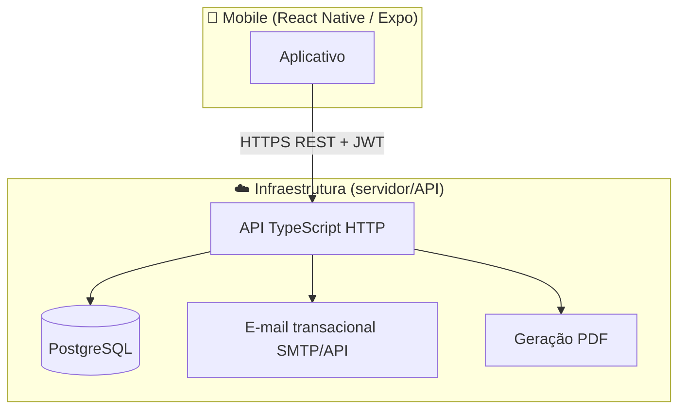

# Arquitetura planejada — Sênior Teste Funcional

**Público:** equipe de uma pessoa (você).  
**Restrições de produto (PRD/requisitos):** app mobile como canal principal, instrumentos padronizados, histórico, gráficos, PDF, recuperação de senha por e-mail, dados por fisioterapeuta.  
**Restrições técnicas fixas:** cliente em **React Native**.  
**Preferência declarada:** **TypeScript**.

Este documento descreve **como estruturar o sistema para maximizar segurança, manutenibilidade e velocidade sendo um desenvolvedor só**, usando TypeScript ponta a ponta. Está **alinhado** ao [PRD.md](../produto/PRD.md) e ao [levantamento-requisitos.md](../produto/levantamento-requisitos.md), sem substituí-los.

Para **prioridade ao `backend/`**, fluxo com **frontend rascunho** até o **handoff ao design**, leia também **[repositorio-e-fluxo-desenvolvimento.md](./repositorio-e-fluxo-desenvolvimento.md)**.

---

## 1. Princípios diretores

| Princípio | O que significa aqui |
|-----------|---------------------|
| **Backend é fonte da verdade** | Pontuações, cortes parametrizados, permissão (“só meus pacientes”), PDF estável — tudo validado/persistido no servidor. |
| **Monólito primeiro** | Uma API, um banco — evita dispersão operacional até existir dor real de escala. |
| **TypeScript ponta a ponta** | Menos erro de contrato entre app e API; mesmo idioma nos dois lados facilita onboarding mental (importante sendo solo). |
| **Domínio explícito por instrumentos** | TUG/Katz/Berg/Tinetti/MEEM têm modelos diferentes — separar por módulos/pastas, não uma “mega entidade AvaliacaoGenérica”. |
| **PDF e e-mail no servidor** | Comportamento previsível e layout A4 igual em todos os celulares. |

---

## 2. Visão de alto nível (C4 simplificado)



**Cliente:** apenas consome APIs; armazena localmente só **tokens** e **cache de leitura** (opcional), nunca autoridade sobre regras de negócio clínicas.

---

## 3. Stack recomendada (solo + TS + RN)

### 3.1 Cliente mobile

| Peça | Escolha sugerida | Motivo |
|------|-----------------|--------|
| Framework | **Expo + React Native** | Menos trabalho nativo inicial, fluxo de build e updates mais simples para uma pessoa. |
| Navegação | **React Navigation** | Padrão de mercado, boa comunidade. |
| Estado servidor | **TanStack Query (React Query)** | Lista de pacientes, histórico, invalidação por mutação — reduz código manual em telas repetitivas. |
| Estado local leve | **Zustand** ou contexto bem pequeno | Fluxo wizard (instrumento → paciente → tutorial → execução) sem Redux pesado. |
| Formulários | **React Hook Form + Zod** | Validações alinhadas ao que o backend já valida (`zod`). |
| Auth em dispositivo | **expo-secure-store** (ou equivalente) | Guardar access/refresh ou sessão sem plain-text em AsyncStorage livre. |
| HTTP | **fetch ou ky** centralizado em um cliente com interceptadores | Injeta Bearer, tratamento de 401/conflito básico. |

**Bare React Native:** só vale a pena se você **cedo** precisar de libs nativas que o Expo gerencia mal (improvável no MVP da PRD).

### 3.2 Backend (API)

| Peça | Escolha principal | Alternativa más leve |
|------|-------------------|----------------------|
| Runtime | **Node.js LTS** | Idem |
| Framework | **NestJS** — módulos por domínio (auth, therapists, patients, assessments, instruments) | **Fastify + @fastify/jwt + plugins próprios** — menos estrutura, mais manual |
| ORM | **Prisma + PostgreSQL** | **Drizzle** — mesmo espírito, SQL mais próximo |

**Por que NestJS + Prisma na minha recomendação “padrão” para você:**

- **Um dev só**: a estrutura de módulos e injeção de dependência obriga lugares óbvios para novas rotas e evita arquivo “megazord”.
- **Prisma**: migrações versionadas (`prisma migrate`) e tipos gerados combinam bem com cliente TS e com evolução de schema (instrumentos/versionamento).
- Se em alguma sprint você achar Nest “pesado demais”, a **fronteira bem desenhada** (REST OpenAPI/Zod por rota) permite trocar o framework sem reescrever o app.

### 3.3 Banco de dados

**PostgreSQL** em ambiente hospedado (Neon, Supabase só como Postgres, RDS, Railway, Render, Fly — qualquer um que você preferir mantendo backup simples).

### 3.4 PDF

| Abordagem | Quando usar |
|-----------|--------------|
| **Servidor gerando PDF** (recomendado) — ex.: `@react-pdf/renderer` no Node, Puppeteer/Chromium para HTML→PDF ou bibliotecas tipo PDFKit templates | MVP alinhado à PRD: layout A4 idêntico, assinatura/carimbo, gráficos reproduzíveis |
| Cliente só gera arquivo “local” sem servidor | Mais risco de divergência iOS/Android e mais trabalho sua em dupla manutenção |

### 3.5 E-mail (recuperação de senha)

Provedores transacionais com API simples (ex.: **Resend**, AWS SES via SMTP/API, SendGrid — escolha por custo/região). O app não envia e-mail; só chama a API que agenda o envio.

---

## 4. Organização do repositório (decisão do projeto)

Este repositório Git usa **pastas de primeiro nível** explícitas (prioriza clareza com equipe futura):

```
/backend           # Primeiro foco de implementação (API + Postgres + Swagger)
/frontend          # React Native Expo — inicialmente telas rascunho até design fechar UI
/packages          # (Opcional posterior) Contratos TS/Zod ou eslint compartilhado
/docs              # Produto + arquitetura + modelo de dados
```

Fluxo recomendável de mudanças: primeiro **mudar modelo + endpoints no `backend`** e atualizar contrato (**OpenAPI**); depois ajustar o `frontend` apenas às mensagens já estáveis JSON.

### Monorepo com **Bun** (workspaces)

O fluxo recomendado de toolchain é **Bun** (`bun install`, `bun run`, `bun test`) com **workspaces** declarados na raiz em um `package.json` privado:

```json
{
  "name": "senior-test",
  "private": true,
  "workspaces": ["backend", "frontend", "packages/*"]
}
```

Pastas continuam sendo `backend/` e `frontend/`; use **`packages/`** opcional (ex.: `shared-contracts` com Zod).

- **NestJS:** scripts típicos via `bun run …`; gere o projeto conforme docs do `@nestjs/cli`.  
- **Prisma:** prefira `bunx prisma migrate dev`; se algum comando do CLI falhar por binário específico, use **`npx prisma …`** só naquele passo (exceção pontual).  
- **Expo:** Bun é suportado para criar projeto e gerenciar dependências ([guia Expo + Bun](https://docs.expo.dev/guides/using-bun/)); **EAS Build** permanece igual após configurar `eas.json`.  

Trocar depois por **npm** ou **pnpm** não invalida arquitetura nem as **fases A→E** — só ajuste manifestos e CI.

```
/packages               # Opcional posterior
  /shared-contracts     # Zod + tipos
```

Se preferir não usar monorepo, pode dividir em dois repositórios desde que **`semver + OpenAPI`** continuem explícitos, como em **[repositorio-e-fluxo-desenvolvimento.md](./repositorio-e-fluxo-desenvolvimento.md)**.

---

## 5. Módulos de domínio (API)

Orientação modular alinhada aos RFs e ao fluxo `instrumento → paciente → tutorial → execução → feedback`:

| Módulo | Responsabilidades |
|--------|---------------------|
| **Auth** | Registro/login, hashing (Argon2/bcrypt), JWT access+refresh ou sessão persistida conforme você preferir revisar segurança, recuperação RF003 |
| **Therapists / Users** | Perfil profissional, associações |
| **Patients** | CRUD por `therapistId`, inclusão escolaridade para MEEM |
| **Instrument catalog** | Lista RF007 — metadados (nome, autores), versão textual do tutorial quando não estiver só no cliente |
| **Assessments** | Sessões: qual instrumento, qual paciente, timestamps, payloads por tipo (`tug_sessions`, estruturas Katz/… ou JSON validado strict + colunas pesquisáveis onde fizer sentido) |
| **Scoring rules** | Tabelas de corte parametrizadas (versão/versionTag) aplicadas pelo servidor ao finalizar |
| **Reporting** | Gera PDF, URL assinada temporária ou stream download |
| **Notifications** | Enfileiramento leve ou chamada síncrona ao provedor para token de recuperação |

**MEEM:** persistir sempre `schoolingInterpretationBand` ou similar **na própria linha da avaliação** (valor usado nos cortes após confirmar/corrigir na sessão), conforme especificação do levantamento.

---

## 6. Fluxos relevantes

### 6.1 Autenticação (RF001–RF003)

```
Mobile → POST /auth/login → API valida → retorna tokens
Mobile guarda tokens no Secure Storage
Calls subsequentes: Authorization: Bearer <access>

Refresh + rotação: recomendável para vida longa sem relog frequente — implementar quando já tiver primeira versão usável do resto.
```

Recuperação: `POST /auth/forgot-password` → gera código 6 dígitos, TTL 10 min, invalida uso único conforme RF003.

### 6.2 Nova avaliação (RF007–RF011)

```
GET /instruments          → lista alfabética + autores
POST /assessments/draft   → cria sessão incompleta (opcional mas útil para salvar racional)
PATCH ou PUT por etapa    → persiste payloads parciais (reduz “perdi tudo ao fechar o app”) — opcional MVP
POST /assessments/:id/finalize → servidor recalcula score, aplica cortes, retorna classification

Mobile mostra resultado (RF011) e links para histórico / PDF.
```

Persistência parcial (rascunho) **não** está obrigada no PRD, mas para uma pessoa no campo é um **ótimo segundo passo** após MVP mínimo.

### 6.3 Gráfico (RF012)

API expõe `GET /patients/:id/instruments/:code/timeseries` retornando `[{ date, rawValue, label }]`. O app só desenha (Recharts não roda nativo sem WebView — usar **Victory Native**, **React Native SVG** + próprio, ou libs como `gifted-charts` conforme gosto).

### 6.4 PDF (RF013)

`POST /reports/assessment/:assessmentId` ou `GET` com JWT que gera e devolve arquivo. Opcionalmente grava arquivo em objeto (S3) se quiser reaproveitar o mesmo arquivo — para MVP pode ser só geração on-the-fly.

---

## 7. Segurança e privacidade (mínimos sensatos)

Mesmo antes de formalizar RS/RNF no documento de requisitos:

- HTTPS obrigatório em produção.  
- Senhas com hash forte server-side (**Argon2id** quando disponível via lib).  
- **Todas as queries escopadas** por `therapistId` derivado do token — nunca confiar apenas em IDs mandados pelo cliente.  
- Armazenar **IP** opcional apenas se necessário; foco LGPD pragmático: só dados que o MVP precisa + política futura explícita.  
- Tokens de recuperação **hasheados no banco** (igual reset token best practice).

---

## 8. Ambientes e deploy (proposta objetiva para solo)

| Camada | Sugestão prática |
|--------|------------------|
| **API + worker leve** (se fila futura) | Railway, Fly.io, Render, ou VPS simples |
| **Postgres gerenciado** | Neon ou Supabase (Postgres apenas) ou o mesmo provedor da API |
| **Mobile distribuição interna** | Expo EAS Build + distribuição ad hoc / Internal testing |
| **CI** | GitHub Actions só quando doer — inicialmente pode ser deploy manual |

Variáveis `.env`: `DATABASE_URL`, `JWT_SECRET`, `SMTP ou RESEND_*`, buckets se usar.

---

## 9. Fases de construção

As fases foram **explicitamente partidas** entre:

- **prioridade Backend** até contrato estável;  
- **Frontend rascunho** válido apenas funcionalmente;  
- **UI futura pela equipe de design**.

Consulte **[repositorio-e-fluxo-desenvolvimento.md](./repositorio-e-fluxo-desenvolvimento.md)** (Fases **A→E**) e **[modelo-de-dados.md](./modelo-de-dados.md)**. Resumo rápido alinhado à PRD:

1. **Fundação (backend, Fase A):** Postgres + RF001–RF005 e OpenAPI inicial — frontend opcional até aqui estar sólido.  
2. **Núcleo avaliações (backend, Fase B):** um instrumento ponta‑a‑ponta (sugerido **TUG**), expandir Katz/Berg/Tinetti e por último **MEEM** (escolaridade).  
3. **Frontend rascunho (Fase C):** fluxos RF usando API real sem acabamento visual.  
4. **Design externo + UI definitiva (Fases D–E):** componentes/tokenização substituindo placeholders.  
5. **Histórico, gráfico e PDF RF006/012/013** assim que backend entregar séries/PDF estáveis para o cliente se apoiar.  
6. **Endurecer** quando RNF/RS entrarem no escopo oficial (rate limit, observabilidade, etc.).

---

## 10. O que eu **evitaria** neste cenário solo

| Armadilha | Por quê |
|----------|---------|
| GraphQL no MVP | Boilerplate maior para uma pessoa que precisa CRUD bem definido por RF. REST + Zod costuma bastar. |
| Microserviços | Sobrecarga operacional desproporcional. |
| Lógica de pontuação só no cliente | Divergência, fraude benigna/acidental, relatório inconsistente. |
| Backend em linguagem só “por hype” quando você já quer TS | Você já favorece TS; tirar tipo compartilhado sem ganho forte atrapalha ritmo solo. |

---

## 11. Próximo passo de documentação

Quando você for implementar, mantenha sempre atualizado:

1. **[modelo-de-dados.md](./modelo-de-dados.md)** e migrações reais correspondentes ao schema.  
2. **Contrato OpenAPI** — fonte vivo no **`backend/`** (Swagger Nest) ou snapshot versionado em **[`../contratos/`](../contratos/README.md)** (ex.: cópias `openapi-v1.yaml` quando fizer sentido ao time).

---

## Referências internas

- [PRD.md](../produto/PRD.md) — visão produto e prioridades  
- [levantamento-requisitos.md](../produto/levantamento-requisitos.md) — RF001–RF013 em detalhe  
- [repositorio-e-fluxo-desenvolvimento.md](./repositorio-e-fluxo-desenvolvimento.md) — pastas backend/frontend, prioridades e fases com design  
- [modelo-de-dados.md](./modelo-de-dados.md) — ER inicial e glossário das entidades  
- [Protocolos clínicos (Markdown)](../protocolos-clinicos/README.md) — roteiros e referências bibliográficas por instrumento  
