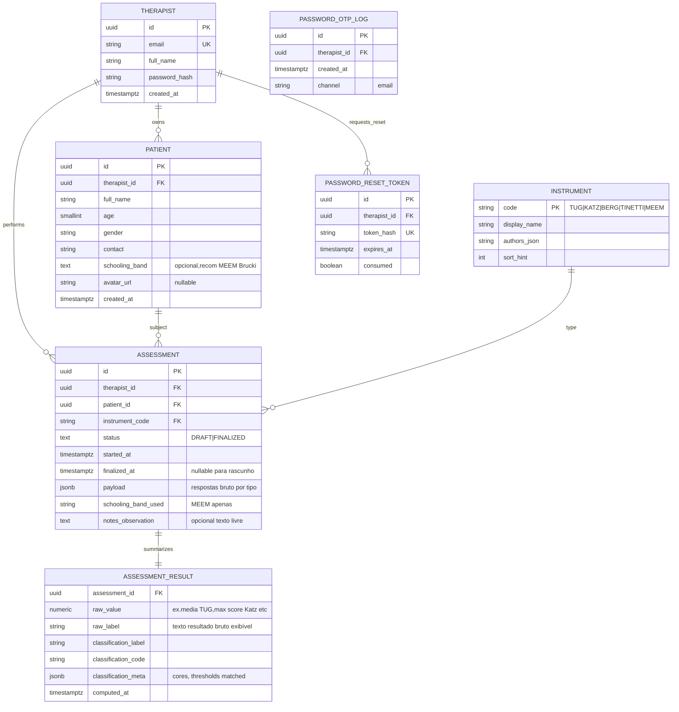

# Modelo de dados (conceitual e ER inicial)

Este documento **não substitui** migrations Prisma definitivas; serve para **alinhar você, design futuro e implementação da pasta `backend/`** sobre quais **entidades** existem no PostgreSQL em torno das requisitos RF001–RF013.

Versão inicial pensada como **PostgreSQL normalizado**, com payloads de avaliações **semi-estruturados** até consolidar todas as restrições de instrumento por tabela física opcional posterior.

---

## 1. Princípio de segregação (`therapist_id`)

Toda leitura/escrita de paciente ou avaliação deve ser sempre **consistente com o usuário profissional autenticado** — no modelo relacionado pelo campo `Therapist`. O backend **injeta filtro obrigatório** (nunca confiar em ID de paciente vindos do cliente isoladamente para autorização).

---

## 2. Diagrama ER (conceitual)

> **Notas de modelagem:**
>
> - `ASSESSMENT.payload` permite **rápido** iterar payloads JSON validados pelo backend com **schemas Zod/JSON-schema distintos** por `instrument_code` sem criar primeiro 5 tabelas filhas físicas cada uma com migrações adicionadas (você poderá migrar payloads calorosos para linhas físicas quando houver relatórios/analytics específicos).  
> - **`schooling_band_used`** na linha da avaliação atende RF005/RF010 sobre **valor efetivo usado nos cortes** daquela aplicação.  
> - Tabela OTP/log separada só se quiser auditoria fina RF003 ; senão ficar apenas em `PASSWORD_RESET_TOKEN`.

---

## 3. Glossário rápido

| Conceito RN / PRD | Tabela / campo |
|------------------|----------------|
| Fisioterapeuta autenticado | `THERAPIST` |
| Paciente só do profissional | `PATIENT.therapist_id` |
| Sessão de avaliação (antes feedback) | `ASSESSMENT` `status`, `payload` até finalizar |
| Resultado número + texto + cor | `ASSESSMENT_RESULT` gerado apenas em `finalize` |
| Lista instrumentos ordenada alfabetica RF007 | `INSTRUMENT` seedada via migration |
| Gráficos / histório **RF012** | Agregações a partir de avaliações `FINALIZED` + resultado, ordenação cronológica |
| MEEM schooling track | campo em `ASSESSMENT` + resultado comparado aos thresholds Brucki em serviço de domínio |

---

## 4. Índices iniciais sugeridos (performance previsível)

- `Patient(therapist_id, lower(full_name))` — lista + buscas RF005.  
- `Assessment(therapist_id, patient_id, instrument_code, finalized_at DESC)` — série temporal RF012 RF006 linha cronológicas.  
- `Assessment(status)` onde `DRAFT` — limpeza ou jobs futuros (ex.: remover rascunhos antigos opcionalmente, fora obrigatoriedade MVP).

---

## 5. Futuras extensões (não obrigatórias agora)

| Extensão | Motivo típico |
|----------|----------------|
| Tutorial versionado pelo servidor (**RF009**) | Migra texto dos Markdown de `docs/protocolos-clinicos/instrumentos/` para campos permitindo versionamento quando fechar navegações |
| objetos externos S3 relatórios pré-gerados | cache PDF idênticos |
| Auditoria PHI estendidas | conformidade institucional adicional LGPD HIPAA-like |

---

## Referências internas

- [repositorio-e-fluxo-desenvolvimento.md](./repositorio-e-fluxo-desenvolvimento.md)  
- [arquitetura.md](./arquitetura.md)  
- Requisitos: [levantamento-requisitos.md](../produto/levantamento-requisitos.md)  
