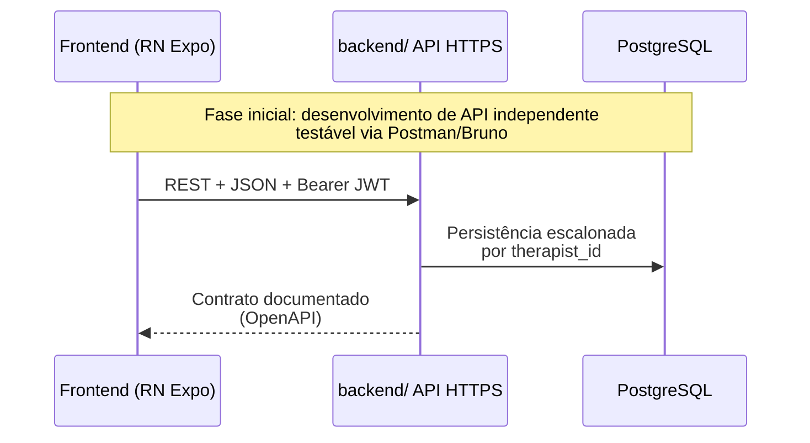

# Repositório, separação Backend / Frontend e fluxo de trabalho

Este documento descreve **como o projeto no Git será organizado e em que ordem evoluir**, considerando:

- código **separado** em **`backend/`** e **`frontend/`** dentro do mesmo repositório (um clone, dois produtos implantáveis diferentes);
- **prioridade ao backend**, para que domínio, regras e contratos estejam estáveis antes de investir tempo em UX final;
- **telas inicialmente como rascunho** no app React Native — a **implementação visual definitiva** virá da **equipe de design** posteriormente.

Ele complementa [arquitetura.md](./arquitetura.md) e [PRD.md](../produto/PRD.md).

---

## 1. Estrutura do repositório (visão atual)

Na raiz do Git:

```
senior-test/
├── README.md
├── docs/                              # Toda especificação (ver docs/README.md)
│   ├── README.md                     # Índice canônico + mapa mental
│   ├── produto/                      # O quê construir + RFs formais
│   ├── engenharia/                   # Como construir + dados + fluxo dev
│   ├── protocolos-clinicos/instrumentos/ # Conteúdo clínico (não são requisitos de software literal)
│   └── contratos/                    # Snapshot OpenAPI quando existir
├── backend/
├── frontend/
├── package.json                      # Bun workspaces (quando scaffold existir)
├── bun.lock
└── packages/                         # Opcional (ex.: shared-contracts)
```

**Por que um só repositório (monorepo leve)?**  
Facilita versão única dos requisitos, issue tracking e revisão ponta a ponta quando você trabalha só ou coordena poucas pessoas. Se mais tarde você quiser **split** em dois repositórios (`senior-backend` / `senior-mobile`), a fronteira bem definida **OpenAPI + versionamento semver da API** torna esse corte menos doloroso.

### 1.1 Toolchain: Bun (recomendado neste projeto)

Use **Bun** na raiz do repositório para **instalar dependências** (`bun install`) e **rodar scripts** em cada workspace (ex.: `bun run --filter backend start:dev`, conforme os `scripts`/`name` de cada `package.json`). Também vale centralizar comandos úteis no `package.json` da raiz (`"dev:api": "bun run --filter backend start:dev"`). Veja workspaces em **[arquitetura.md §4](./arquitetura.md)**.

Benefícios no seu cenário (desenvolvimento solo): comandos rápidos, menos atrito ao alternar entre API e Expo, um único `bun.lock` para os dois apps.

---

## 2. Hierarquia de prioridades de trabalho

| Ordem | Foco | Objetivo |
|-------|------|----------|
| **1** | **Backend** — modelo de dados, autenticação, escopo por fisioterapeuta | “Fonte da verdade” disponível por HTTP, testável sem app bonito |
| **2** | **Contrato da API** (OpenAPI 3 ou equivalente mantido pelo backend) | Design e cliente rascunho podem trabalhar contra **forma e nomes estáveis dos dados** |
| **3** | **Frontend — camadas finas**: cliente HTTP + fluxo navegação RF + telas funcionais **sem acabamento visual** | Prova que os RFs batem com a API antes do design final |
| **4** | **Design** — Figma ou similar (equipe externa): componentes, grid, cores, tipografia, estados empty/loading erro | Substituindo progressivamente placeholders do passo 3 |
| **5** | **Frontend — UI definitiva** | Mapa telas/design → troca gradual de RN “rascunho” pelos tokens e layouts fechados |

**Regra de ouro:** o backend **não depende** do React Native para ser validado — use coleção Bruno/Insomnia, testes automatizados e (quando disponível) **documentação Swagger** gerada pela API.

---

## 3. Fases recomendadas (**aderidas** — roadmap operacional principal)

Roteiro **A→E**: backend + contrato **antes** de investir pesado em UX final — este é o **norte oficial** deste projeto.

### Fase A — Backend: fundação (RF001–RF005)

- Persistência Postgres (ver [modelo-de-dados.md](./modelo-de-dados.md)).
- Registro/login/recuperação (e-mail token 6 dígitos, TTL, invalidação — RF003).
- CRUD pacientes com vínculo `therapist_id`, escolaridade onde aplicável.
- **Swagger/OpenAPI exposto em dev** ou arquivo `openapi.yaml` gerado na build da API.

**Saída desta fase:** API utilizável apenas com cliente HTTP ou Postman ; frontend ainda opcional.

### Fase B — Backend: avaliações (RF007–RF013, por instrumentos)

Instrumento piloto típico: **TUG** (estrutura de dados menor). Repetir padrão para Katz, Berg, Tinetti, MEEM.

- Catálogo de instrumentos estável (`GET /instruments`).
- Ciclo criar/avaliar/finalizar com **servidor calculando pontuações e cortes**.
- Séries histórico para gráfico (`timeseries`).
- Endpoint de relatório PDF (stream ou redirect assinado).

**Saída:** contrato da API suficientemente completo para a equipe de design **entender dados** disponíveis (sem precisar adivinhar JSON “no escuro”).

### Fase C — Frontend “rascunho”

- Fluxo obrigatório da PRD: instrumento → paciente → tutorial (pode ler Markdown estático por instrumento inicialmente ou `GET tutorial` quando existir na API).
- Formulários e listas usando **Estilo Mínimo** (componentes padrão do RN, placeholders de texto tipo “Lista pacientes”).
- Consumir apenas implementações já entregues no backend para não inventar mocks que enganem você.

Rotular no código ou comentário quando uma tela for **placeholder** até design fechar (“SUBSTITUIR quando Figma XYZ estiver disponível”).

### Fase D — Design (equipe externa)

- Entrega de **biblioteca de componentes UI** ou **arquivo Figma**: telas nomeadas alinhadas ao mapa RF (lista paciente, avaliação, feedback, PDF, perfil/histórico, etc.).
- Acordo de tokens: espaçamentos, tipo de botão primário/secundário, inputs, estados erro.
- Opcionalmente **Protótipo navegável** para validação com o time clínico (fora escopo só seu — mas você consome resultado).

### Fase E — Frontend UI definitiva

Refatorações **principalmente cosméticas e de navegação** sobre a mesma arquitetura de dados já testada na Fase C:

- Extrair tema (cores/fontes/espacamentos) desde tokens do design system.
- Trocar componentes “generic” por wrappers `AppButton`, `AppTextField`.
- Animar apenas onde design pedir sem mudar payloads da API sem necessidade.

---

## 4. Como o Backend e o Frontend “conversam”



- **Única lingua franca oficial:** payloads e códigos HTTP documentados na OpenAPI (`backend` é dono principal do arquivo/versionamento semver `v1`).
- Frontend **mapeia telas aos endpoints** usando um cliente gerado opcionalmente (ex.: openapi-typescript-codegen) ou Tipos escritos uma vez até gerador existir.

---

## 5. Implicações para a equipe de design

Informar (ou documentar em link no Figma README):

1. Tipos principais já expostos: `Paciente`, `Instrumento`, `AvaliacaoEmAndamento`, `ResultadoFeedback`, `SerieTemporal`, `UsuarioProfissional` em termos funcionais não técnicos.
2. Fluxos obrigatórios da PRD (ordem wizard, bloqueios de finalização, mensagens de lista vazia).
3. O que pertence ao **servidor**: PDF gerado igual em todos celulares, e-mails de recuperação.

Assim Design **não desenha** telas irreais (ex.: “classificação no meio da coleta do MEEM” sem flag de UX explícito que quebra requisitos).

---

## 6. Gestão Git sugerida (simples para um dev líder backend)

| Prática | Descrição |
|---------|-----------|
| **Branch principal** (`main`) | Sempre compilável onde aplicável ; merge pequenos incrementos |
| **Features backend** (`feat/api-forgot-password`, etc.) | Concluído + testes antes de merge |
| **Features frontend stub** pode ir na mesma `main` com flag “UI provisional” até design chegar |

Se no futuro houver CI: pipeline separado opcional com **Bun** — ex.: `{ backend: bun run lint && bun test }, { frontend: bun run lint && npx expo doctor }` (ou equivalente aos scripts definidos em cada pacote).

---

## 7. Artefatos mínimos a manter enquanto projeto crescer

| Artefato | Local sugerido | Finalidade |
|----------|-----------------|------------|
| OpenAPI YAML/JSON (snapshot ou espelho) | [`docs/contratos/`](../contratos/README.md) *e/ou* saída do Swagger em `backend/` | Design, mobile e checagens de conformidade contra o contrato |
| Changelog técnico resumido | `CHANGELOG.md` raiz opcional OU notas Release GitHub | “Quebrou coisa quando subiu v2?” |

---

## 8. Referências cruzadas

- [modelo-de-dados.md](./modelo-de-dados.md) — entidades relacionais esperadas pela API atual  
- [arquitetura.md](./arquitetura.md) — stack técnico e decisões já tomadas  
- [PRD.md](../produto/PRD.md) / [levantamento-requisitos.md](../produto/levantamento-requisitos.md) — comportamento esperado pelo produto  

---

*Documentação viva — ajustar conforme adoção efetiva de OpenAPI gerado versus arquivo estático, e conforme entrada da equipe de design.*
