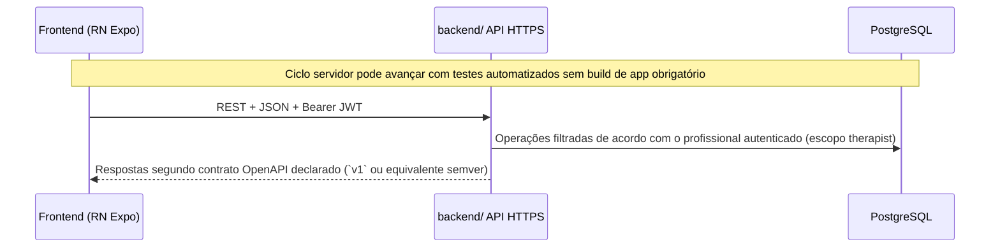

# Repositório, separação Backend / Frontend e fluxo de trabalho

Este documento formaliza **como o projeto versionado será organizado** e **qual ordem de entrega preserva custo e conformidade**:

- **`backend/`** e **`frontend/`** no mesmo repositório Git (mesmo ciclo release, dois artefatos implantáveis independentes — API e app);
- Prioridade inicial ao servidor — domínio, regras, persistência e **contratos HTTP públicos** estáveis **antes** de investir proporcionalmente em refinamento visual;
- Implementação inicial do cliente móvel com **prioridade comportamental**, evoluindo depois pela **camada de apresentação** conforme **design system** institucional ou material gráfico aprovado pela governança de produto.

Complementos obrigatórios: [arquitetura.md](./arquitetura.md), [PRD.md](../produto/PRD.md), [levantamento-requisitos.md](../produto/levantamento-requisitos.md), [privacidade-e-lgpd.md](../produto/privacidade-e-lgpd.md).

---

## 1. Estrutura do repositório

```
senior-test/
├── README.md
├── docs/                              # Especificação (índice: docs/README.md)
│   ├── README.md                     # Índice canônico
│   ├── produto/                      # Requisitos e LGPD
│   ├── engenharia/                   # Arquitetura, modelo de dados, fluxo
│   ├── protocolos-clinicos/instrumentos/  # Referência clínica
│   └── contratos/                    # Snapshots OpenAPI quando versionados aqui
├── backend/
├── frontend/
├── package.json                      # Bun workspaces (quando o scaffold existir)
├── bun.lock
└── packages/                         # Opcional (`shared-contracts`, etc.)
```

**Monorepo leve.** Manter código e documentação próximos reduz divergências entre código e texto normativo. Se o repositório for futuramente particionado (por exemplo `senior-backend` / `senior-mobile`), uma fronteira bem definida — **contrato OpenAPI** e **versionamento semântico da API** — reduz custo dessa migração.

### 1.1 Toolchain: Bun

`bun install` na raiz, scripts por workspace (`bun run --filter <pacote> <script>`), aliases úteis no `package.json` raiz quando prático. Workspace detalhado em **[arquitetura.md §4](./arquitetura.md)**.

Benefícios: instalações rápidas, alternância suave CLI entre API e Expo, lockfile único para dependências repetidas cliente-servidor.

---

## 2. Hierarquia de prioridades

| Ordem | Foco | Objetivo |
|-------|------|----------|
| **1** | **Backend**: modelo Postgres, auth, vínculos `therapist_id` conforme modelo | API testável apenas com cliente HTTP automatizado/manual |
| **2** | **Contrato público**: OpenAPI 3 ou ferramentas equivalentes derivadas da implementação real | Consumidores (cliente próprio ou integrações) compilam schemas sem “achismos JSON” |
| **3** | **Cliente RN**: navegações RF validadas contra API real sem investimento pesado inicial em marca | Fechar ciclo comportamental oficial antes da camada cosmética |
| **4** | **Camada visual**: artefatos de design (tokens, biblioteca própria, guias WCAG institucional) quando disponíveis | Uniformidade com identidade institucional |
| **5** | **Refino de interface sobre contratos já congelados** | Melhor UX sem regressão de payload sem necessidade de negócio |

**Invariante.** O comportamento da API deve ser verificável por testes automatizados no servidor, coleções HTTP (Bruno, Insomnia) e documentação OpenAPI. O cliente móvel **não substitui** a validação servidor nem é obrigatório para a primeira homologação funcional das rotas públicas já implementadas.

---

## 3. Fases A→E — roteiro adotado

### Fase A — Backend fundação (`RF001`–`RF005`)

- Schema PostgreSQL inicial ([modelo-de-dados.md](./modelo-de-dados.md)).  
- Registro, login e recuperação (token TTL, invalidações — [`RF003`](../produto/levantamento-requisitos.md)).  
- CRUD de pacientes vinculado ao terapeuta, campos obrigatórios MEEM.  
- Swagger/OpenAPI acessível em desenvolvimento **ou** `openapi.yaml` versionado pela build CI.

**Entrega esperada:** servidor utilizável apenas via HTTP antes de obrigar trabalho paralelo pesado na interface.

### Fase B — Avaliações servidor (`RF007`–`RF013`)

Instrumentos na ordem acordada; **padrão** costuma iniciar pelo **TUG** (payload mais contido antes de Katz/Berg/Tinetti/**MEEM**).

- Lista canônica de instrumentos (`GET /instruments`).  
- Recalculo de pontuações e aplicação de cortes sempre **pelo servidor** ao finalizar a sessão.  
- Séries temporais para gráfico e geração de PDF com semânticas estáveis.

**Saída:** contrato público suficiente para especialistas UX ou comunicação visual lerem payloads e estados esperados antes de elaborar artefatos de alta fidelidade.

### Fase C — Cliente comportamental inicial

Fluxo obrigatório produto (`instrumento` → `paciente` → `tutorial` → `execução` → `feedback` → exportações relacionadas):

- Tutorial inicialmente conforme texto versionado em `docs/protocolos-clinicos/` e `docs/produto/` até haver decisão sobre conteúdo dinâmico exposto pela API.  
- Componentização suficientemente clara para manutenção, priorizando corretitude funcional; identidade visual aplica‑se quando os artefatos estiverem formalizados.  
- Evitar mocks estáticos que simulem respostas inexistentes no servidor homologável.


### Fase D — Design institucional

Quando houver artefatos de **design tokens**, bibliotecas próprias de componentes e guias para estados (carregamento, vazio, erro), manter nomenclatura e fluxos espelhando o mapa oficial de **RF**.

Protótipo navegável pode apoiar validações com stakeholders autorizados (contexto institucional de saúde); qualquer decisão oriunda desse ciclo atualiza **`docs/produto/`** antes das alterações de código correspondentes.

### Fase E — Harmonização de interface

Refactors majoritariamente visuais (tema único; componentes wrappers como `AppButton`) **sem** alterar contratos HTTP enquanto o produto oficial não registra novo RF.

---

## 4. Comunicação tecnológica entre Backend e Frontend



O cliente mobile consome apenas contratos atualizados; a OpenAPI no servidor deve ser tratada como **fonte técnica de verdade**, salvo espelhos opcionais em `docs/contratos/` quando assim for decidido. Opcional codegen (`openapi-typescript-codegen`) ou compartilhamento de schemas (**Zod**) em `packages/`.

---

## 5. Artefatos de design e alinhamento de domínios

Ao produzir guias UX ou documentação gráficas (Figma, Penpot ou equivalent):

1. Conceitos funcionais públicos já modelados pela API — por exemplo Paciente, Instrumento, Sessão, Resultados, Séries históricas e identidade profissional — traduzidos em linguagem própria aos guias de UX quando necessário (sem ambiguar campos obrigatórios).  
2. Restrições de fluxo vindas da PRD: ordem do assistente (**wizard**), bloqueios de finalização até coleta válida e proibições de feedback antecipado onde assim estiver especificado (**MEEM**, entre outros casos sensíveis de produto).  
3. PDF e correio para recuperação de credenciais ficam sempre no servidor para **saídas equivalentes** em todas as variantes cliente suportadas do app.

Fluxos ou logs que tratam dados pessoais (incluindo **saúde**): devem estar coerentes com **[privacidade-e-lgpd.md](../produto/privacidade-e-lgpd.md)** antes de uso em ambientes autorizados com titulares reais.

---

## 6. Gestão Git e integração contínua

| Prática | Descrição |
|---------|-----------|
| **Branch principal** (`main`) | Estado estável compilável sempre que projetos compiláveis já existirem; merges restritos ao que passou revisão combinada código + especificação. |
| **Branches temáticas** (`feat/backend-*`, `feat/mobile-*`, etc.) | Ciclos curtos de entrega para evitar divergência prolongada servidor/cliente ou documentação/implementação. |
| **Recursos incompletos** | *Feature flags* ou equivalentes apenas quando seguranças e tratamento dados sensíveis **nunca** ficam ocultados por cosméticas inacabadas. |

Exemplo CI multi‑workspace conforme toolchain adotado: `{ backend: bun run lint && bun test }, { frontend: bun run lint && npx expo doctor }` (adaptar aos `scripts` declarados quando o código existir).

---

## 7. Artefatos mínimos enquanto crescer

| Artefato | Onde guardar |
|----------|---------------|
| OpenAPI oficial / snapshots marcados semver | Swagger runtime + opcional cópias `docs/contratos/` |
| Changelog técnico público opcional | `CHANGELOG.md` na raiz ou notas junto releases Git etiquetadas |

---

## 8. Referências cruzadas

- [modelo-de-dados.md](./modelo-de-dados.md)  
- [arquitetura.md](./arquitetura.md)  
- [PRD.md](../produto/PRD.md), [levantamento-requisitos.md](../produto/levantamento-requisitos.md), [privacidade-e-lgpd.md](../produto/privacidade-e-lgpd.md)  

---

*Documentação viva.* Harmonizar sempre que mudar apenas pipeline OpenAPI gerada vs arquivo estático, ou quando atualizar artefatos oficiais de design (tokens, biblioteca própria de componentes).
