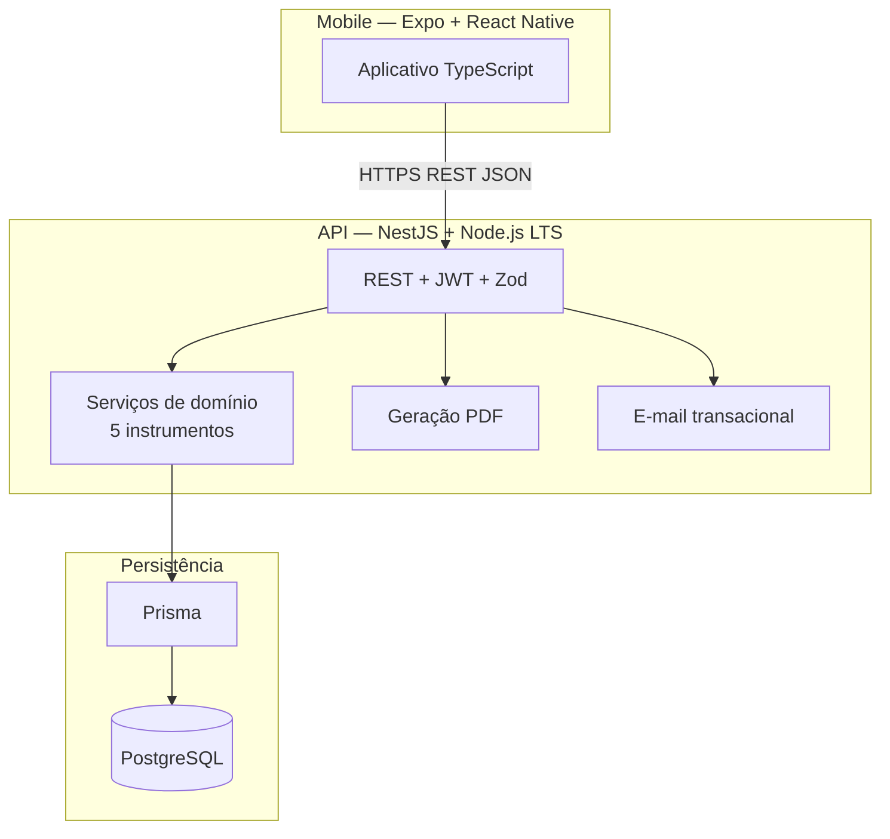
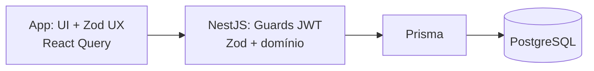

# Arquitetura do sistema — Sênior Teste Funcional

**Público:** engenharia, produto técnico e implementação (incluindo agentes automatizados).  
**Status:** stack e desenho **oficiais** deste repositório. Mudanças de tecnologia base exigem atualizar este arquivo (e, se aplicável, ADR em `engineering/adr/`).

**Alinhamento:** [PRD.md](../product/PRD.md), [requirements.md](../product/requirements.md), [privacy-and-lgpd.md](../product/privacy-and-lgpd.md), [data-model.md](./data-model.md). Fases de entrega: [repository-and-workflow.md](./repository-and-workflow.md).

**Restrições de produto:** aplicativo **mobile** como canal principal; cinco instrumentos (**TUG, Katz, Berg, Tinetti, MEEM**); histórico longitudinal; PDF por instrumento (sem relatório consolidado multi-teste); segregação por fisioterapeuta; recuperação de senha via API + e-mail.

---

## 1. Princípios diretores

| Princípio | O que significa aqui |
|-----------|---------------------|
| **Backend é fonte da verdade** | Pontuações, cortes, permissão (“só meus pacientes”), PDF — validados e persistidos no servidor. |
| **Monólito primeiro** | Uma API NestJS, um PostgreSQL — até existir dor real de escala. |
| **TypeScript ponta a ponta** | `backend/`, `frontend/` e opcional `packages/shared` em TypeScript. |
| **Domínio por instrumento** | Cinco protocolos com payloads e regras distintas — módulos/pastas separados, não uma avaliação genérica opaca. |
| **PDF e e-mail no servidor** | Layout A4 e envio transacional previsíveis em qualquer dispositivo. |
| **Contrato HTTP explícito** | REST + OpenAPI (Swagger no Nest) como referência do cliente; snapshots opcionais em `docs/contracts/`. |

---

## 2. Visão de alto nível (C4 simplificado)



**Cliente:** consome API; persiste localmente **tokens** (expo-secure-store) e cache de leitura (TanStack Query). **Não** é autoridade sobre regra clínica.

---

## 3. Stack oficial

### 3.1 Resumo

| Camada | Tecnologia adotada |
|--------|-------------------|
| **Mobile** | **Expo + React Native + TypeScript** |
| **API** | **Node.js LTS + NestJS + TypeScript** |
| **Banco** | **PostgreSQL** (instância gerenciada em produção) |
| **ORM** | **Prisma** (`prisma migrate`, tipos gerados) |
| **Validação** | **Zod** (API; compartilhável com app via `packages/shared-contracts`) |
| **Auth** | **JWT** (access; refresh em evolução) + **Argon2id** (preferível) ou **bcrypt** |
| **Estado remoto no app** | **TanStack Query** |
| **Estado local (wizard)** | **Zustand** ou contexto mínimo |
| **Formulários no app** | **React Hook Form + Zod** |
| **Navegação** | **Expo Router** (file-based; motor React Navigation) |
| **HTTP no app** | Cliente centralizado (**fetch** ou **ky**) + Bearer |
| **Monorepo** | **Bun workspaces** (`backend`, `frontend`, `packages/*`) |
| **Contrato** | **REST + OpenAPI 3** (Swagger Nest) |
| **PDF** | **Servidor** — ex.: `@react-pdf/renderer`, Puppeteer/HTML→PDF ou PDFKit |
| **E-mail (RF003)** | **Servidor** — ex.: Resend, AWS SES (app não envia e-mail direto) |
| **Build mobile** | **EAS Build** (Expo Application Services) |

### 3.2 Instrumentos cobertos pela mesma stack

Todos os protocolos do MVP usam o mesmo pipeline (Prisma + JSONB + Zod por `instrument_code` + serviço de scoring dedicado):

| Código | Instrumento | Resultado principal (servidor) |
|--------|-------------|--------------------------------|
| `TUG` | Timed Up and Go | Média (s) de 3 ensaios |
| `KATZ` | Índice de Katz | Estrato 0–6 (contagem de domínios **D**) |
| `BERG` | Escala de Berg | Soma 0–56 |
| `TINETTI` | Escala de Tinetti | Soma 0–28 |
| `MEEM` | Mini-Exame do Estado Mental | Soma 0–30 + cortes por escolaridade |

Roteiros clínicos: [clinical-protocols/instruments/](../clinical-protocols/instruments/). Coleta: **RF010**; feedback: **RF011**.

### 3.3 Cliente mobile (detalhe)

| Peça | Adotado | Observação |
|------|---------|------------|
| Framework | Expo + React Native | Bare RN só se requisito de plataforma impedir Expo (exige ADR) |
| Navegação | **Expo Router** | Rotas em `app/`; grupos `(auth)` / `(main)` — ver [frontend README §10](../frontend/README.md) |
| Gráficos RF012 | **Victory Native**, **react-native-gifted-charts** ou **react-native-svg** | API entrega série `[{ date, rawValue, label }]`; **não** Recharts |
| Tokens | expo-secure-store | Evitar credenciais em AsyncStorage sem proteção |

### 3.4 Backend (detalhe)

| Peça | Adotado |
|------|---------|
| Framework | **NestJS** — módulos: `auth`, `therapists`, `patients`, `instruments`, `assessments`, `scoring-rules`, `reports`, `notifications` |
| Validação entrada | **Zod** via pipes ou camada explícita antes do serviço |
| Documentação API | **@nestjs/swagger** → OpenAPI |

Estrutura sugerida por instrumento dentro de `assessments` ou `instruments/`:

```
instruments/
  tug/      # schema Zod + scoring TUG
  katz/
  berg/
  tinetti/
  meem/
```

### 3.5 PostgreSQL — por que este banco

O domínio é relacional (profissional → pacientes → avaliações → resultados). Exige transações na finalização, integridade referencial e consultas temporais por `patient_id` + `instrument_code`. **`JSONB`** em `Assessment.payload` acomoda formulários diferentes sem abandonar SQL.

Hospedagem (escolha operacional): Neon, Railway, Render, RDS, Fly.io, etc. — com backup automático e região adequada ao controlador (LGPD).

### 3.6 PDF e relatórios (produto)

| Regra | Implementação |
|-------|----------------|
| PDF por avaliação/instrumento | **RF013** — `POST/GET` relatório ligado a `assessmentId` |
| **Sem** PDF único com todos os instrumentos | Histórico agregado no app (**RF006**), não mega-relatório |
| Gráfico no PDF | Só se ≥ 2 avaliações do **mesmo** instrumento; senão mensagem explícita |

---

## 4. Tratamento dos dados

### 4.1 Divisão de responsabilidades



| Camada | Responsabilidade |
|--------|------------------|
| **PostgreSQL** | Persistência durável, FKs, índices, JSONB |
| **Prisma** | Schema, migrações, repositórios tipados |
| **Zod** | Validar payloads REST; schemas espelhados no app quando em `packages/shared-contracts` |
| **Serviços de domínio** | Scoring, cortes, classificação, isolamento `therapist_id` |
| **App** | Coleta UX, exibição, gráfico desenhado a partir da série da API |

### 4.2 O que o app faz e não faz

| Fazer no app | Não fazer no app |
|--------------|------------------|
| Wizard, cronômetro TUG, formulários Berg/Tinetti/MEEM/Katz | Calcular resultado oficial ou estrato Katz |
| Listas e cache (TanStack Query) | Gerar PDF institucional |
| Secure store para JWT | Autorizar paciente só pelo `patientId` do body sem checagem no servidor |

### 4.3 Modelo de persistência de avaliações

Conforme [data-model.md](./data-model.md):

- Tabelas relacionais: `Therapist`, `Patient`, `Instrument`, `Assessment`, `AssessmentResult`, tokens de recuperação.
- `Assessment.payload`: **JSONB** validado com **Zod** conforme `instrument_code`.
- `Assessment.schooling_band_used` (ou equivalente): valor efetivo nos cortes do **MEEM** naquela sessão.
- `AssessmentResult`: preenchido no **`finalize`**, não confiar em cálculo só no cliente.

Tabelas físicas por item de instrumento: **somente** se analytics futuros exigirem; não é pré-requisito do MVP.

---

## 5. Organização no repositório de documentação

Neste Git, **não há pastas de código** na raiz. A especificação de cada camada fica em:

| Camada | Documentação |
|--------|----------------|
| API | [../backend/README.md](../backend/README.md) |
| App mobile | [../frontend/README.md](../frontend/README.md) |
| Transversal | `docs/engineering/`, `docs/product/`, `docs/contracts/` |

**Quando o código existir** (monorepo ou repos separados), estrutura alvo típica:

```
backend/          # NestJS + Prisma + OpenAPI (implementação)
frontend/         # Expo + React Native (implementação)
packages/         # Opcional: shared-contracts (Zod)
```

**Fluxo de mudança:** modelo + API + OpenAPI primeiro; depois app contra contrato estável. Por tela/RF: backend do contrato → UI Figma ([repository-and-workflow.md §2.1](./repository-and-workflow.md), [figma-map.md](../frontend/figma-map.md)). Toolchain prevista: Bun workspaces, Prisma, Expo — ver [repository-and-workflow.md](./repository-and-workflow.md).

---

## 6. Módulos de domínio (API NestJS)

| Módulo | Responsabilidades |
|--------|---------------------|
| **Auth** | RF001–RF003: registro, login, hash senha, JWT, recuperação (código 6 dígitos, TTL 10 min) |
| **Therapists** | Dados do profissional autenticado |
| **Patients** | CRUD/lista RF004–RF005; filtro obrigatório por `therapistId` do token |
| **Instruments** | Catálogo RF007 (5 itens, autores, ordem alfabética); tutorial RF009 (conteúdo estático ou versionado depois) |
| **Assessments** | Sessões RF008–RF010; rascunho opcional; `finalize` dispara scoring |
| **Scoring rules** | Tabelas de corte versionadas (`versionTag`) por instrumento |
| **Reports** | PDF RF013 por `assessmentId` |
| **Notifications** | Disparo e-mail transacional (RF003) |

**Isolamento:** todo endpoint de paciente/avaliação valida que o recurso pertence ao `therapistId` do JWT — nunca confiar só no ID enviado pelo cliente.

---

## 7. Fluxos técnicos principais

### 7.1 Autenticação (RF001–RF003)

```
POST /auth/register | /auth/login → JWT access (+ refresh futuro)
Authorization: Bearer <access> nas rotas protegidas
POST /auth/forgot-password → e-mail com token; POST /auth/reset-password
```

Tokens de recuperação: hash no banco; uso único; expiração conforme RF003.

### 7.2 Nova avaliação (RF007–RF011)

```
GET  /instruments
POST /assessments/draft              # opcional — rascunho
PATCH /assessments/:id               # payload parcial — opcional pós-MVP núcleo
POST /assessments/:id/finalize       # scoring + AssessmentResult + classificação
```

Ordem de produto (telas): instrumento → paciente → tutorial → execução → feedback. Ordem de UI pode ser revisitada; ambos os vínculos são obrigatórios antes de RF010.

### 7.3 Gráfico (RF012)

```
GET /patients/:patientId/instruments/:code/timeseries
→ [{ date, rawValue, classificationLabel? }]
```

App renderiza; mensagem se &lt; 2 pontos no mesmo instrumento.

### 7.4 PDF (RF013)

```
POST /reports/assessments/:assessmentId   # ou GET equivalente autenticado
→ application/pdf (A4, profissional + paciente + instrumento + gráfico se couber)
```

MVP: geração on-the-fly; cache em objeto (S3) opcional depois.

---

## 8. Segurança e LGPD (âmbito técnico)

Detalhes de governança: [privacy-and-lgpd.md](../product/privacy-and-lgpd.md).

| Medida | Adoção |
|--------|--------|
| HTTPS em produção | Obrigatório |
| Hash de senha | Argon2id preferível |
| Escopo por profissional | Guard + queries com `therapistId` |
| Logs | Minimização; retenção definida pelo controlador |
| Segredos | `.env` / secrets CI — nunca no Git |

---

## 9. Ambientes e implantação

| Camada | Diretriz |
|--------|----------|
| API | PaaS (Railway, Fly, Render) ou VM |
| PostgreSQL | Gerenciado, backup automático, mesma região que a API quando possível |
| Mobile | EAS Build; distribuição interna/teste conforme política institucional |
| CI/CD | GitHub Actions (lint/test por workspace) quando código existir |

**Variáveis de ambiente (referência):**

| Variável | Uso |
|----------|-----|
| `DATABASE_URL` | Postgres |
| `JWT_ACCESS_SECRET` | Access token |
| `JWT_REFRESH_SECRET` | Refresh (quando implementado) |
| `RESEND_API_KEY` / SES | E-mail RF003 |

---

## 10. Fases de construção (resumo)

Roteiro completo: [repository-and-workflow.md](./repository-and-workflow.md).

| Fase | Entregável técnico |
|------|-------------------|
| **A** | Postgres + Prisma + Nest auth/pacientes RF001–RF005 + OpenAPI |
| **B** | Cinco instrumentos no servidor (ordem sugerida: TUG → Katz → Berg → Tinetti → MEEM) + timeseries + PDF |
| **C–E** | Expo: fluxos RF, depois design system, sem quebrar contrato HTTP |

---

## 11. Anti-padrões (não adotar neste projeto)

| Anti-padrão | Motivo |
|-------------|--------|
| GraphQL no lugar de REST/OpenAPI | RFs mapeiam bem em REST; custo de governança desnecessário no MVP |
| Microsserviços antes da dor | Operação e segurança de rede prematuras |
| Firebase/Firestore como backend de regras clínicas | Regras e PDF ficam opacos; fraco para auditoria |
| MongoDB “pela flexibilidade dos instrumentos” | JSONB + Zod no Postgres resolve |
| Scoring ou PDF só no cliente | Divergência iOS/Android; LGPD/auditoria |
| Redux global | TanStack Query + Zustand bastam |
| Relatório PDF único com todos os instrumentos | Fora do escopo de produto acordado |
| Supabase Auth + RLS **no lugar** da API Nest | Só se decisão explícita com ADR; padrão atual é API própria |

Trocar npm/pnpm por Bun **não** invalida esta arquitetura.

---

## 12. Continuidade documental

Ao codificar, manter sincronizados:

1. [data-model.md](./data-model.md) e, quando houver código, schema Prisma/migrações reais  
2. OpenAPI viva no Nest + snapshots em [../contracts/](../contracts/README.md) quando houver release  
3. Este arquivo e [privacy-and-lgpd.md](../product/privacy-and-lgpd.md), se mudar stack ou fluxos de dados  

---

## Referências

- [PRD.md](../product/PRD.md)  
- [requirements.md](../product/requirements.md)  
- [privacy-and-lgpd.md](../product/privacy-and-lgpd.md)  
- [data-model.md](./data-model.md)  
- [repository-and-workflow.md](./repository-and-workflow.md)  
- [../backend/README.md](../backend/README.md) — como a API deve funcionar  
- [../frontend/README.md](../frontend/README.md) — como o app deve funcionar  
- [clinical-protocols/README.md](../clinical-protocols/README.md)
