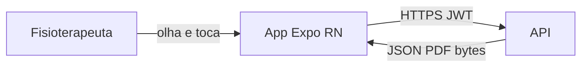
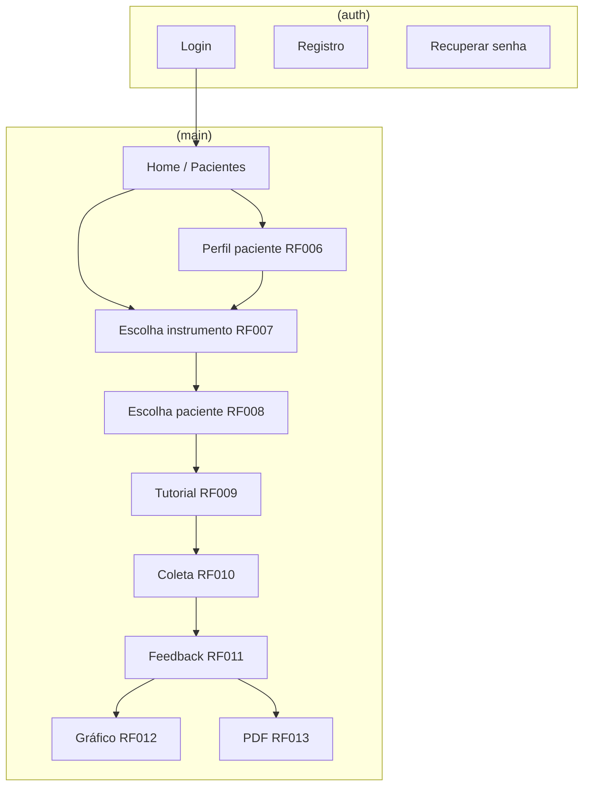

# Frontend — documentação de arquitetura

> **Só documentação** em `docs/frontend/`. Explica **contexto**, **stack com porquês**, **como o app deve funcionar**, **telas e fluxos**, **integração com a API**, **privacidade no dispositivo** e **limites**. Não há código neste repositório.

**Leitura relacionada:** [backend](../backend/README.md) (API) · [architecture](../engineering/architecture.md) · [requirements](../product/requirements.md) · [PRD](../product/PRD.md).

---

## Índice

1. [Contexto do produto](#1-contexto-do-produto)  
2. [Papel do frontend no ecossistema](#2-papel-do-frontend-no-ecossistema)  
3. [Stack oficial e porquês](#3-stack-oficial-e-porquês)  
4. [Como o app deve funcionar](#4-como-o-app-deve-funcionar)  
5. [Fluxos de tela e estados de UX](#5-fluxos-de-tela-e-estados-de-ux)  
6. [Por instrumento (o que a UI coleta)](#6-por-instrumento-o-que-a-ui-coleta)  
7. [Gráficos e PDF no app](#7-gráficos-e-pdf-no-app)  
8. [Dados no dispositivo e LGPD](#8-dados-no-dispositivo-e-lgpd)  
9. [Integração com a API](#9-integração-com-a-api)  
10. [Organização do código (quando existir)](#10-organização-do-código-quando-existir)  
11. [Anti-padrões](#11-anti-padrões)  
12. [Fases C–E e maturidade visual](#12-fases-ce-e-maturidade-visual)  
13. [Mapa Figma (telas e rotas)](figma-map.md)

---

## 1. Contexto do produto

O fisioterapeuta que atende idosos precisa, na prática, de três coisas ao mesmo tempo: **aplicar o protocolo certo**, **registrar com fidelidade** e **ver se o paciente melhorou ou piorou** ao longo das semanas. Papel e planilha falham principalmente no **histórico** e na **padronização do cálculo** ([PRD](../product/PRD.md)).

O **frontend** é o **aplicativo mobile** — o canal onde o profissional **vive** o produto:

- Cadastra conta e pacientes.  
- Escolhe instrumento e paciente, lê o tutorial, conduz a coleta na interface.  
- Vê resultado imediato, gráfico (quando já há histórico) e pede PDF.  

Sem app, a API existe mas **ninguém opera** o sistema no consultório. Por isso o frontend é “canal principal”, mesmo que a **inteligência clínica oficial** mora no [backend](../backend/README.md).

**Público:** fisioterapeuta com formação para aplicar TUG, Katz, Berg, Tinetti e MEEM — o app **não substitui** treinamento clínico; oferece **roteiro e registro** alinhados à spec ([clinical-protocols](../clinical-protocols/README.md)).

---

## 2. Papel do frontend no ecossistema

### 2.1 Definição em uma frase

O frontend é a **camada de experiência**: traduz requisitos (RFs) em telas, envia dados para a API e **mostra** o que o servidor calculou — sem ser autoridade final sobre pontuação, classificação ou PDF institucional.

### 2.2 Divisão clara de responsabilidades

| Pergunta | Resposta no app | Resposta na API |
|----------|-----------------|-----------------|
| “Posso avançar sem preencher item 7 da Berg?” | Bloqueia botão Finalizar (UX) | Rejeita finalize se inválido (Zod) |
| “Qual o estrato Katz oficial?” | Mostra o que a API devolveu | Calcula contagem de D |
| “Qual a média TUG para o PDF?” | Exibe/baixa PDF da API | Calcula e gera arquivo |
| “João é paciente da Maria?” | Não decide — só pede dados | Valida `therapist_id` |
| “Como falar com o idoso no MEEM?” | Tutorial (texto) | Não aplica teste fisicamente |

### 2.3 Diagrama



### 2.4 Por que app mobile (e não web no MVP)

- Uso **ao lado do paciente** (cronômetro TUG, observação da marcha, Berg com deslocamento).  
- Câmera/galeria para **foto opcional** do paciente (RF004) — natural no mobile.  
- Push futuro (lembrete de reavaliação) — opcional, fora do MVP.  

Web permanece **fora do núcleo obrigatório** ([PRD](../product/PRD.md)); pode vir como consulta/gestão depois.

### 2.5 Por que o app deve ser “magro” em regra de negócio

1. **Uma versão da verdade** — Relatório impresso e histórico batem com o que qualquer colega veria em outro aparelho.  
2. **Atualização de cortes** — Mudou tabela MEEM no servidor; app antigo na loja ainda funciona se só **exibir** resultado novo.  
3. **LGPD** — Menos cópia durável de dados sensíveis no flash do celular.  
4. **Menos superfície de bug** — Berg com 14 itens já é complexo na UX; somar motor de scoring duplicado no cliente dobra risco.

---

## 3. Stack oficial e porquês

### 3.1 Tabela resumida

| Tecnologia | Papel no app | Por que esta escolha |
|------------|--------------|----------------------|
| **Expo** | Toolchain RN | Build via EAS, OTA opcional, módulos nativos comuns (secure-store) sem eject inicial |
| **React Native** | UI | Componentes nativos; desempenho aceitável em formulários longos (Berg/Tinetti) |
| **TypeScript** | Tipagem | Alinha com API e Zod; autocomplete nos payloads por instrumento |
| **Expo Router** | Navegação file-based | Rotas `(auth)` vs `(main)` claras; deep link futuro |
| **TanStack Query** | Servidor no cliente | Cache de listas, refetch após salvar, estados loading/error padronizados |
| **Zustand** (ou Context mínimo) | Wizard local | Passo atual (instrumento/paciente/coleta) sem Redux |
| **React Hook Form + Zod** | Formulários | Validação por tela coerente com schemas do servidor |
| **expo-secure-store** | JWT | Token não em AsyncStorage sem proteção |
| **fetch / ky** | HTTP | Interceptor Bearer + tratamento 401 global |
| **Victory Native / gifted-charts / SVG** | RF012 | API entrega pontos prontos; lib web (Recharts) não roda nativo |

### 3.2 Expo vs bare React Native

| Critério | Expo (adotado) | Bare RN |
|----------|----------------|---------|
| Tempo até primeira build | Menor | Maior |
| secure-store, env | Integrado | Manual |
| Requisito nativo raro | Pode exigir eject depois | Já nasce “aberto” |
| Disciplina / MVP | **Adequado** | Só se Expo bloquear requisito |

### 3.3 Por que TanStack Query e não Redux global

A maior parte do estado **vem da API** (pacientes, histórico, resultado). Redux para “lista de pacientes” duplica o que o Query cacheia bem. Redux/Zustand ficam para **wizard de avaliação** (passos, rascunho local temporário) — estado de UI de curta duração.

### 3.4 Por que não calcular preview de MEEM/Katz no app

Mesmo que “pareça útil” mostrar soma parcial:

- RF de MEEM pede **não** exibir pontuação interpretativa até o fim (evita viés na aplicação).  
- PDF e RF011 devem coincidir com **um** motor — o do servidor ([backend](../backend/README.md) §5).

Preview local vira dívida técnica e risco de divergência.

---

## 4. Como o app deve funcionar

### 4.1 Princípios operacionais

| # | Princípio | Na prática |
|---|-----------|------------|
| 1 | **API real em dev integrado** | Evitar mock que “inventa” classificação — mascara bugs de contrato |
| 2 | **JWT em rotas autenticadas** | Sem token → fluxo de login |
| 3 | **Erro legível** | “Sem conexão”, “Sessão expirada” — não stack trace |
| 4 | **Finalizar = chamar finalize** | Botão só habilitado quando formulário válido; resultado na resposta |
| 5 | **Gráfico condicional** | API diz quantos pontos; app não inventa curva com 1 medição |
| 6 | **PDF = arquivo do servidor** | WebView ou share do blob retornado |

### 4.2 Jornada completa (narrativa)

**Maria** abre o app após login:

1. **Home / pacientes** — vê lista de seus pacientes (RF005); busca “João”.  
2. **Novo teste** — escolhe **TUG** (RF007), depois **João** (RF008).  
3. **Tutorial** — lê instruções e materiais (RF009); pode voltar se faltar espaço.  
4. **Coleta** — cronômetro nos 3 ensaios (RF010); vê progresso “Ensaio 2 de 3”.  
5. **Feedback** — API retorna média em segundos + classificação (RF011).  
6. **Primeira TUG** — se pedir gráfico, mensagem: “Realize mais avaliações…”.  
7. **Semanas depois, 2ª TUG** — gráfico de TUG aparece; PDF pode incluir curva.  
8. **MEEM no João** — confirma escolaridade na sessão; app envia; servidor aplica corte Brucki.  

Em nenhum momento o app **decide** que João pertence a outro fisio — se Maria está logada, a API só devolve pacientes dela.

### 4.3 Ordem instrumento → paciente

A spec atual ([requirements](../product/requirements.md)) define **instrumento antes do paciente**. Faz sentido clínico quando o profissional já sabe “hoje é dia de Berg” e escolhe quem aplicar. Se a equipe inverter na UI, **ambos** ainda devem estar definidos antes do tutorial — a API exige vínculos no `finalize`, não a ordem das telas.

---

## 5. Fluxos de tela e estados de UX

### 5.1 Mapa de navegação (alvo)

Handoff visual detalhado (RF ↔ rota ↔ frame Figma, tabela de frames): **[figma-map.md](figma-map.md)**.



### 5.2 Estados que toda lista deve tratar

| Estado | Comportamento esperado |
|--------|------------------------|
| **Loading** | Skeleton ou spinner; não tela branca |
| **Vazio** | “Nenhum paciente cadastrado” + CTA cadastrar (RF005) |
| **Erro rede** | Mensagem + tentar novamente |
| **401** | Limpar token; redirecionar login |
| **Sucesso** | Dados + pull-to-refresh opcional |

Isso vale para pacientes, instrumentos e histórico — padrão repetível reduz bugs.

### 5.3 Wizard de avaliação (estado local)

Enquanto RF010 não terminou, o app pode manter em **Zustand/Context**:

- `instrumentCode`, `patientId` escolhidos  
- Passo atual (tutorial vs coleta)  
- Rascunho local dos campos (opcional)  

Ao **finalize** com sucesso: limpar wizard; **invalidar** queries React Query de histórico e perfil do paciente.

---

## 6. Por instrumento (o que a UI coleta)

A UI implementa **entrada**; o protocolo completo está em [clinical-protocols](../clinical-protocols/instruments/).

| Instrumento | Elementos de UI | Validação na tela | Após finalize |
|-------------|-----------------|-------------------|---------------|
| **TUG** | Cronômetro ou campos segundos; 3 ensaios | Três valores preenchidos | Mostra média + texto API |
| **Katz** | 6 blocos radio I/A/D | Todos domínios | Mostra estrato + descrição API |
| **Berg** | 14 telas ou lista scroll; 0–4 cada | 14 respostas | Soma / classificação API |
| **Tinetti** | 16 itens; indicador “X de 16” | Todos itens | Soma API |
| **MEEM** | Blocos na ordem do protocolo | Tetos por bloco; **sem** total parcial visível | Total + faixa escolaridade usada |

**MEEM — escolaridade:** exibir valor do cadastro (RF004) e permitir **confirmar/corrigir** na sessão; enviar ao servidor o valor **efetivo** para cortes ([backend](../backend/README.md) §5).

**Acessibilidade (direção):** fontes legíveis, alvos de toque amplos (público idoso + profissional em pé), contraste adequado nas fases D–E do [repository-and-workflow](../engineering/repository-and-workflow.md).

---

## 7. Gráficos e PDF no app

### 7.1 Gráfico (RF012) — regra com exemplos

A API devolve série temporal **por paciente e por instrumento**. O app **só desenha**.

| Histórico do paciente | Gráfico TUG | Gráfico Katz |
|----------------------|-------------|--------------|
| 1× TUG, 1× Katz | Não | Não |
| 2× TUG, 1× Katz | **Sim** (TUG) | Não |
| 2× TUG, 2× Katz | Sim | **Sim** |

**Legenda:** produto define que para TUG/Katz **queda** da curva pode significar melhora; para Berg/Tinetti/MEEM **subida** pode significar melhora — texto explicativo na tela ([requirements](../product/requirements.md) RF012).

**Biblioteca:** Victory Native, react-native-gifted-charts ou SVG manual — eixo X data, Y valor, tooltip opcional.

### 7.2 PDF (RF013)

- App chama endpoint de relatório com `assessmentId` da sessão **já finalizada**.  
- Recebe `application/pdf` → visualizar ou compartilhar (share sheet).  
- **Não** montar PDF local com logo + gráfico — diverge do servidor.  
- Se &lt; 2 avaliações do instrumento: PDF pode vir **sem** gráfico e com mensagem (“Sem dados suficientes para evolução”) — texto definido na spec.

**Sem PDF único** reunindo TUG+Katz+Berg+Tinetti+MEEM — decisão de produto; histórico agregado fica no **perfil** (RF006), não em um mega-arquivo.

---

## 8. Dados no dispositivo e LGPD

### 8.1 O que pode ficar no celular

| Dado | Onde | Por quê |
|------|------|---------|
| Access token (JWT) | expo-secure-store | Sessão sem relog constante |
| Cache React Query | Memória/disco do app | Performance; invalidar após mutação |
| Rascunho de formulário | Memória (wizard) | Até finalize ou descarte |
| Preferências UI | AsyncStorage leve | Tema, última rota — sem dado clínico |

### 8.2 O que não deve ser “verdade” local

- Planilha offline exportada como oficial  
- “Último resultado Katz” gravado só no SQLite do app  
- PDF gerado localmente para entregar ao paciente como documento institucional  

Titular dos dados e políticas: [privacy-and-lgpd](../product/privacy-and-lgpd.md). O app deve facilitar operação **sem** expandir tratamento além do necessário.

### 8.3 Foto do paciente

Se RF004 incluir foto: exibir via URL ou asset que a API referenciar; não assumir que foto fica só no dispositivo sem política de armazenamento definida pelo backend futuro.

---

## 9. Integração com a API

### 9.1 Configuração por ambiente

| Ambiente | `EXPO_PUBLIC_API_URL` (exemplo) |
|----------|----------------------------------|
| iOS simulador | `http://localhost:3000` |
| Android emulador | `http://10.0.2.2:3000` |
| Device físico | `http://192.168.x.x:3000` (IP da máquina) |
| Produção | HTTPS domínio institucional |

### 9.2 Cliente HTTP (padrão)

- Base URL + path  
- Header `Authorization: Bearer` quando logado  
- JSON `Content-Type`  
- Tratar timeout com mensagem amigável  

Endpoints e semântica: [backend/README.md](../backend/README.md) §4.

### 9.3 Sincronização após mutações

| Ação do usuário | Invalidar queries (exemplo) |
|-----------------|----------------------------|
| Cadastrou paciente | `['patients']` |
| Finalizou avaliação | `['patients', id]`, `['assessments', ...]`, `['timeseries', ...]` |
| Login/logout | Tudo ou reset cache |

Evita perfil desatualizado após novo teste.

### 9.4 Contrato e tipos

- Ler OpenAPI do backend ao implementar telas.  
- Futuro: pacote `shared-contracts` com Zod compartilhado — mesmo schema no RHF e na API.  
- Snapshots em [contracts](../contracts/README.md).

### 9.5 Offline

**MVP:** não prometer uso pleno offline. Sem rede, listas e finalize falham com mensagem clara. **Evolução:** fila de sync ou rascunho no servidor (PATCH) — prioridade menor que fechar RF com API online ([backend](../backend/README.md) §4.2).

---

## 10. Organização do código (quando existir)

```
frontend/
├── app/
│   ├── (auth)/
│   │   ├── login.tsx
│   │   ├── register.tsx
│   │   └── forgot-password.tsx
│   ├── (main)/
│   │   ├── index.tsx              # lista pacientes
│   │   ├── patients/[id].tsx      # perfil RF006
│   │   └── assessment/
│   │       ├── instrument.tsx     # RF007
│   │       ├── patient.tsx        # RF008
│   │       ├── tutorial.tsx       # RF009
│   │       ├── execute/[code].tsx # RF010 por instrumento
│   │       └── feedback.tsx       # RF011
│   └── _layout.tsx
└── src/
    ├── config/env.ts
    ├── lib/api.ts
    ├── providers/query-provider.tsx
    ├── stores/assessment-wizard.ts
    ├── features/
    │   ├── patients/
    │   ├── instruments/
    │   └── assessments/
    └── components/
```

`execute/[code].tsx` pode ramificar para subcomponentes `TugForm`, `BergForm`, etc. — um arquivo por instrumento mantém complexidade isolada.

---

## 11. Anti-padrões

| Anti-padrão | Consequência |
|-------------|--------------|
| Mock fixo de classificação em dev | App “funciona” com API quebrada |
| AsyncStorage para JWT sem secure | Risco em dispositivo comprometido |
| Recharts no RN | Não roda nativamente como na web |
| Gráfico com 1 ponto inventado | Engana o profissional |
| PDF layout só no app | Diverge do arquivo institucional servidor |
| Lista pacientes sem paginação/busca | RF005 incompleto |
| Mostrar total MEEM durante blocos | Viola RF010 / conduta |
| Ignorar 401 | Telas vazias sem explicação |

---

## 12. Fases C–E e maturidade visual

| Fase | Objetivo | Por que nesta ordem |
|------|----------|---------------------|
| **C** | Todas as telas RF com API real; UI simples | Valida produto e contrato antes de design fino |
| **D** | Tokens cores, tipografia, componentes institucionais | Evita refazer fluxo quando identidade chegar |
| **E** | Polish, animações, microcopy | Não alterar payloads HTTP |

**Dependência:** fases **A–B** do backend entregam auth, pacientes, instrumentos, finalize, timeseries, PDF ([backend](../backend/README.md) §11). Implementar app “completo” em cima de API incompleta gera retrabalho e mocks perigosos.

Cronograma integrado: [repository-and-workflow](../engineering/repository-and-workflow.md).

---

## Referências

- [figma-map.md](figma-map.md) — mapa Figma, rotas e RFs  
- [../backend/README.md](../backend/README.md)  
- [../engineering/architecture.md](../engineering/architecture.md)  
- [../engineering/repository-and-workflow.md](../engineering/repository-and-workflow.md)  
- [../product/requirements.md](../product/requirements.md)  
- [../product/PRD.md](../product/PRD.md)  
- [../product/privacy-and-lgpd.md](../product/privacy-and-lgpd.md)  
- [../clinical-protocols/README.md](../clinical-protocols/README.md)
