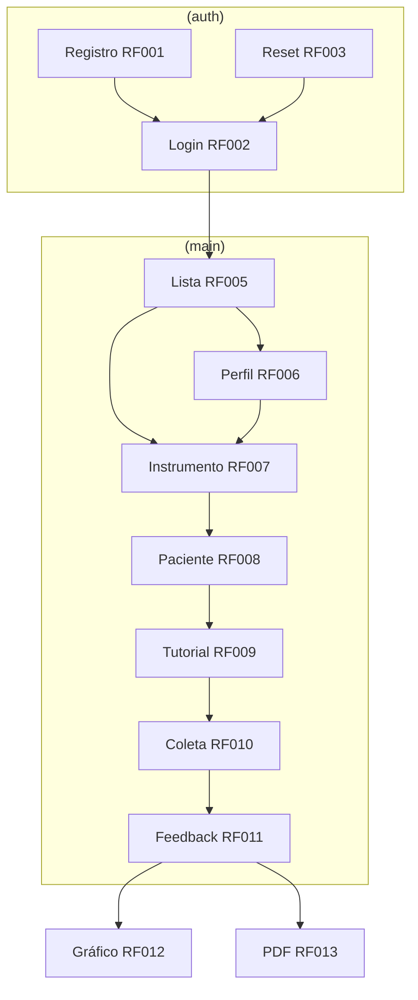

# Mapa Figma — telas, rotas e RFs

> **Fonte canônica** do handoff visual: arquivo Figma oficial ↔ requisitos (RF) ↔ rotas Expo Router.  
> Comportamento e regras de negócio: [requirements.md](../product/requirements.md). Arquitetura do app: [README.md](README.md).

**Implementação:** skill Cursor `figma-to-frontend` (registry de components e checklists ficam em `.cursor/skills/figma-to-frontend/reference.md`).

---

## Arquivo Figma

| Campo | Valor |
|-------|--------|
| **Projeto** | Senior Teste Funcional |
| **URL** | https://www.figma.com/design/mtMbhRez2Xy2k414cfzcFm/Senior-Test-Funcional |
| **File key** | `mtMbhRez2Xy2k414cfzcFm` |
| **Entrada (telas)** | [node `1:11490`](https://www.figma.com/design/mtMbhRez2Xy2k414cfzcFm/Senior-Test-Funcional?node-id=1-11490) |

**Frame específico:** selecione o frame no Figma e use `?node-id=X-Y` na URL (API interna: `X:Y`).

**Legendas de fluxo:** anotações no arquivo (setas, “→ Login”, “401 → sessão expirada”) são mapa de navegação — validar contra [README §5.1](README.md) e a tabela abaixo.

---

## Mapa RF → rota Expo Router (alvo)

Atualize a coluna **Frame Figma** conforme confirmar nomes no arquivo.

| RF | Nome funcional | Rota Expo (alvo) | Fluxo / pré-requisito |
|----|----------------|------------------|------------------------|
| RF001 | Cadastro fisioterapeuta | `app/(auth)/register.tsx` | → login ou home após sucesso |
| RF002 | Login | `app/(auth)/login.tsx` | → home; link reset |
| RF003 | Recuperar senha | `app/(auth)/forgot-password.tsx` | token 6 dígitos, nova senha |
| RF004 | Cadastro paciente | modal/rota em `(main)/` ou `patients/new` | campos MEEM escolaridade |
| RF005 | Lista + busca pacientes | `app/(main)/index.tsx` | home; CTA cadastro |
| RF006 | Perfil + histórico | `app/(main)/patients/[id].tsx` | → novo teste (RF007) |
| RF007 | Escolha instrumento | `app/(main)/assessment/instrument.tsx` | antes RF008 |
| RF008 | Escolha paciente | `app/(main)/assessment/patient.tsx` | instrumento já escolhido |
| RF009 | Tutorial | `app/(main)/assessment/tutorial.tsx` | instrumento + paciente |
| RF010 | Execução teste | `app/(main)/assessment/execute/[code].tsx` | TUG/Katz/Berg/Tinetti/MEEM |
| RF011 | Feedback | `app/(main)/assessment/feedback.tsx` | pós-finalize API |
| RF012 | Gráfico evolutivo | seção em perfil ou rota dedicada | ≥2 aval. mesmo instrumento |
| RF013 | PDF | ação em feedback/perfil | PDF bytes da API |

### Instrumentos RF010 (`[code]` na rota Expo)

Rotas usam **minúsculas**; a API persiste `instrument_code` em **MAIÚSCULAS** (`TUG`, `KATZ`, …).

| code (rota) | API (`instrument_code`) | Protocolo | UI destacada |
|-------------|-------------------------|-----------|--------------|
| `tug` | `TUG` | [tug](../clinical-protocols/instruments/tug/) | 3 ensaios, cronômetro |
| `katz` | `KATZ` | [katz](../clinical-protocols/instruments/katz/) | 6× radio I/A/D |
| `berg` | `BERG` | [berg](../clinical-protocols/instruments/berg/) | 14 itens 0–4 |
| `tinetti` | `TINETTI` | [tinetti](../clinical-protocols/instruments/tinetti/) | 16 itens |
| `meem` | `MEEM` | [meem](../clinical-protocols/instruments/meem/) | blocos; sem score parcial |

---

## Diagrama de fluxo (spec)

---

## Tabela Frame Figma (preencher na implementação)

| Frame Figma (nome) | node-id | RF | Rota implementada | Status |
|--------------------|---------|-----|-------------------|--------|
| *(ex.: Login)* | | RF002 | `app/(auth)/login.tsx` | |
| | | | | |

**Manutenção:** ao implementar um frame confirmado, adicione uma linha nesta tabela. Se o nome do frame no Figma divergir do RF, documente na coluna **Frame Figma** e mantenha o RF como referência de comportamento.

---

## Ordem de entrega por tela

Ao implementar um RF com UI no Figma:

1. **Backend** — endpoints, validação Zod e OpenAPI do RF (ou fatia necessária) homologáveis via HTTP.
2. **Frontend** — tela conforme frame Figma + [README](README.md) + WCAG; consumir API real, sem mock de classificação.

Detalhe do fluxo de trabalho: [repository-and-workflow.md §2.1](../engineering/repository-and-workflow.md).

---

## Referências

- [README.md](README.md) — arquitetura e stack do app  
- [requirements.md](../product/requirements.md) — RFs  
- [backend/README.md](../backend/README.md) — endpoints §4  
- [repository-and-workflow.md](../engineering/repository-and-workflow.md) — fases A→E e Git
