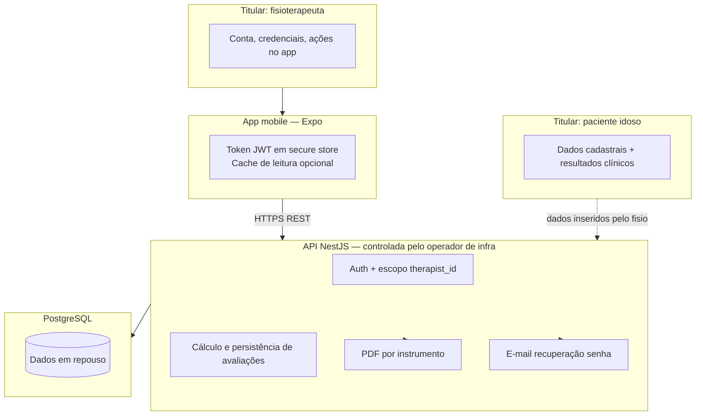

# Privacidade e LGPD — Sênior Teste Funcional

**Norma:** [Lei nº 13.709/2018 (LGPD)](http://www.planalto.gov.br/ccivil_03/_ato2015-2018/2018/lei/l13709.htm) · [ANPD](https://www.gov.br/anpd/pt-br)

**Escopo deste documento:** tratamento de dados pessoais e **sensíveis (saúde)** no produto descrito em [PRD.md](./PRD.md) e [requirements.md](./requirements.md), com medidas técnicas alinhadas a [architecture.md](../engineering/architecture.md) e [data-model.md](../engineering/data-model.md).

**Limite:** orientação **interna ao repositório** para produto e engenharia. Avisos ao titular, contratos com operadores, bases legais finais e designação de encarregado (DPO) competem ao **controlador** da implantação, com assessoria jurídica.

---

## 1. Como o sistema trata dados (visão operacional)

| Etapa do produto | O que é tratado | Onde persiste |
|-----------------|-----------------|---------------|
| Cadastro/login fisio (RF001–RF003) | Nome, e-mail, hash de senha, tokens de recuperação | `Therapist`, `PasswordResetToken` |
| Pacientes (RF004–RF006) | Nome, idade, sexo, contato, escolaridade (MEEM), foto opcional | `Patient` (sempre com `therapist_id`) |
| Avaliação (RF007–RF011) | Respostas por instrumento, data/hora, profissional, escolaridade usada no MEEM | `Assessment.payload` (JSONB), `AssessmentResult` |
| Histórico / gráfico (RF006, RF012) | Série temporal derivada de avaliações finalizadas | Consultas agregadas; sem cópia desnecessária no app |
| PDF (RF013) | Identificação paciente/fisio, resultado, interpretação, gráfico se ≥2 do mesmo instrumento | Gerado no servidor; download transitório (opcional cache em objeto) |

**Regra central:** o app **não** é fonte da verdade clínica; não armazena pontuação oficial nem PDF institucional fora do que a API devolve para exibição.

---

## 2. Papéis na LGPD

| Papel | Quem costuma ser | Papel no sistema |
|-------|------------------|------------------|
| **Controlador** | Clínica, instituição de ensino ou fisio titular da implantação | Define finalidades, prazos, aviso de privacidade, resposta a titulares |
| **Operador** | Equipe que hospeda API/banco; provedores listados na §8 | Trata dados **por instrução** do controlador (contrato art. 41) |
| **Encarregado (DPO)** | Indicado pelo controlador quando exigido | Canal com ANPD e titulares; não substituído por este Markdown |

Os **titulares** típicos são: **paciente** (dados sensíveis de saúde e identificação) e **fisioterapeuta** (dados de conta e registro profissional de uso).

---

## 3. Inventário de dados (por categoria)

| Categoria | Dados | Sensível? | RF / entidade | Finalidade no produto |
|-----------|-------|-----------|---------------|------------------------|
| Conta profissional | Nome, e-mail, credenciais | Identificação | RF001–RF003 · `Therapist` | Autenticação e responsabilização das ações |
| Cadastro paciente | Nome, idade, sexo, contato | Identificação | RF004 · `Patient` | Vínculo assistencial e comunicação |
| Contexto MEEM | Faixa de escolaridade | Pode reforçar sensibilidade no contexto clínico | RF004, RF010 · `Patient`, `Assessment.schooling_band_used` | Interpretação parametrizada do MEEM |
| Foto paciente | Imagem (opcional) | Biométrica se permitir identificação direta | RF004 · `Patient.avatar_url` | Identificação visual na lista/perfil |
| Avaliação funcional | Tempos TUG, itens Katz/Berg/Tinetti, blocos MEEM, observações | **Saúde / funcionalidade** | RF010–RF011 · `Assessment`, `AssessmentResult` | Acompanhamento e decisão clínica assistida |
| Metadados de sessão | Data/hora, `therapist_id`, instrumento | Identificação + saúde (contexto) | Automático · `Assessment` | Rastreabilidade e histórico |
| Relatório PDF | Subconjunto dos dados acima | Mesma natureza dos dados fonte | RF013 | Documento para prontuário/arquivo do profissional |
| Logs técnicos | IP, user-agent, erros (se coletados) | Identificação indireta | Política do controlador | Segurança e diagnóstico — **minimizar** |

**Minimização aplicada ao desenho atual:**

- Sem relatório PDF único agregando todos os instrumentos (reduz exposição em um único arquivo).
- Escolaridade no cadastro **recomendada**, não obrigatória exceto quando o fluxo MEEM exige para cortes.
- Lista de pacientes **sem** ID interno exposto ao fisio (RF005).
- Isolamento: fisio A **não** acessa pacientes do fisio B (ver §5).

---

## 4. Bases legais (orientação — validar com jurídico)

Dados de **saúde** (art. 11) exigem hipótese legal específica. Em contexto de **apoio à avaliação fisioterapêutica** de pacientes sob responsabilidade do profissional, hipóteses frequentemente analisadas (não automáticas):

| Tratamento | Hipótese usual em análise | Observação |
|------------|---------------------------|------------|
| Registros clínicos das avaliações | Prestação de assistência à saúde / tutela da saúde (art. 11) | Depende do vínculo institucional e documentação do controlador |
| Conta do fisio | Execução de contrato / legítimo interesse (art. 7) | Dados de conta, não sensíveis de saúde |
| E-mail de recuperação de senha | Execução de contrato / segurança | Conteúdo mínimo; token com TTL 10 min (RF003) |

**Consentimento** não deve ser usado como “padrão único” para todos os fluxos sensíveis sem análise. O **aviso de privacidade** do controlador deve listar finalidades, bases, operadores, prazos e direitos (art. 9).

---

## 5. Controle de acesso e confidencialidade

Implementação obrigatória conforme arquitetura:

| Requisito | Implementação |
|-----------|---------------|
| Autenticação | JWT (Bearer); credenciais com hash forte (Argon2id preferível) |
| Autorização | Todo `patient_id` / `assessment_id` validado contra `therapist_id` do token |
| Transporte | HTTPS em produção |
| Dispositivo | Tokens em `expo-secure-store`; evitar senha em log |
| PDF | Gerado sob identidade do fisio logado; amarrado ao paciente da avaliação (RF013) |
| Recuperação senha | Código 6 dígitos, 10 min, hash do token no banco, uso único (RF003) |

**Cenário proibido:** confiar em `patientId` enviado pelo app sem checagem de posse no servidor.

---

## 6. Direitos dos titulares (art. 18) e suporte pelo sistema

O controlador atende solicitações; o software deve **facilitar**:

| Direito | Como o produto apoia (atual ou evolução) |
|---------|------------------------------------------|
| Confirmação / acesso | Exportação ou telas de perfil (RF006); API pode expor export estruturado (evolução) |
| Correção | Edição cadastro paciente (RF004); correção escolaridade na sessão MEEM com registro na avaliação |
| Eliminação | Exclusão lógica de paciente/avaliações com política de retenção definida pelo controlador (evolução explícita em RF) |
| Portabilidade | Export JSON/PDF já previsto parcialmente via PDF por instrumento; pacote completo (evolução) |
| Informação sobre compartilhamento | Documentação institucional + §8 deste arquivo |

Registrar em `requirements.md` quando priorizar fluxos formais de exclusão/exportação para titulares.

---

## 7. Retenção e descarte

| Dado | Diretriz para o controlador definir | Nota técnica |
|------|-------------------------------------|--------------|
| Avaliações finalizadas | Enquanto relação de cuidado + prazos legais/archivamento institucional | Backup de Postgres replica retenção |
| Rascunhos de avaliação | Política curta ou limpeza periódica | Campo `status = DRAFT` |
| Tokens recuperação | Expiram em 10 min (RF003); removidos do banco quando expiram ou após 24h | RF003 |
| Logs | Prazo mínimo necessário | Evitar logar payload clínico completo |
| PDF em cache S3 | TTL alinhado ao controlador | Opcional no MVP |

**Anonimização** para estatísticas agregadas: só com critérios irreversíveis e finalidade compatível (art. 5º, VI).

---

## 8. Operadores e subprocessadores (preencher na implantação)

| Serviço | Exemplo de provedor | Dados expostos | Contrato LGPD |
|---------|---------------------|----------------|---------------|
| Hospedagem API | Railway, Fly, Render, AWS | Tráfego e metadados | Exigir cláusulas art. 41 |
| PostgreSQL gerenciado | Neon, RDS, Supabase (DB only) | Todos os dados em repouso | Mesma região preferencialmente (Brasil se possível) |
| E-mail transacional | Resend, SES, SendGrid | E-mail do fisio, conteúdo do token | DPA / termos |
| Build/distribuição app | Expo EAS | Metadados de build, credenciais dev | Política Expo |
| Armazenamento PDF (opcional) | S3-compatible | Cópias de relatórios | DPA |

**Transferência internacional** (art. 33–36): avaliar país do provedor com suporte jurídico antes de produção.

---

## 9. Incidentes e segurança

| Medida | Responsável |
|--------|-------------|
| Plano de resposta a incidentes | Controlador |
| Comunicação ANPD/titulares quando cabível | Controlador (prazos legais) |
| RIPD | Quando aplicável ao tratamento em escala/risco |
| Backups criptografados, teste de restore | Operador de infra |
| Rotação de segredos JWT / DB | Operador |

Em incidente com vazamento de avaliações: considerar gravidade elevada (dados sensíveis de saúde).

---

## 10. Checklist por nova funcionalidade

Antes de merge que introduza novo dado ou integração:

- [ ] Qual categoria LGPD? Sensível?  
- [ ] Finalidade documentada no PRD/requirements?  
- [ ] Base legal indicada pelo controlador?  
- [ ] `therapist_id` / autorização cobertos?  
- [ ] Novo subprocessador listado na §8?  
- [ ] Retenção definida?  
- [ ] Aviso de privacidade institucional precisa atualizar?

---

## 11. Referências no repositório

- [PRD.md](./PRD.md) · [requirements.md](./requirements.md)  
- [architecture.md](../engineering/architecture.md) · [data-model.md](../engineering/data-model.md)  
- [clinical-protocols/README.md](../clinical-protocols/README.md)

---

## 12. Revisão LGPD — RF013 (relatório PDF) · 2026-07-23

**Escopo:** implementação de `POST /reports/assessments/:assessmentId`, builder PDF no servidor e botão “Gerar relatório PDF” no detalhe da avaliação (perfil RF006).

**Classificação:** dados **pessoais** (nome, idade, sexo do paciente e fisio) + **sensíveis de saúde** (resultados funcionais, interpretação, evolução gráfica, observações clínicas opcionais, escolaridade no MEEM).

**Finalidade:** documento clínico para arquivo/prontuário do **profissional responsável**, emitido após avaliação presencial (RF013).

### Checklist §10 (engenharia)

| Item | Status | Evidência / nota |
|------|--------|------------------|
| Categoria LGPD identificada | ✅ | §3 deste arquivo — linha “Relatório PDF” |
| Finalidade em requirements/PRD | ✅ | RF013 · [requirements.md](./requirements.md) · [PRD.md](./PRD.md) |
| Base legal (controlador) | ⏳ | Hipótese usual: art. 11 (assistência/tutela da saúde) — **validar com jurídico/DPO** |
| Autorização `therapist_id` | ✅ | Query com `therapistId` do JWT; e2e `reports.e2e-spec.ts` (404 cross-tenant) |
| Novo subprocessador | ✅ N/A | Mesmos operadores da API/Postgres; **sem** S3/cache PDF no MVP |
| Retenção | ✅ (MVP) | Servidor **não persiste** PDF; app grava cópia **transitória** em cache local só para share/download |
| Aviso de privacidade institucional | ⏳ | Controlador deve mencionar geração de PDF e destino (arquivo do profissional) |

### Minimização aplicada na implementação

| Dado | Incluído no PDF? | Motivo |
|------|------------------|--------|
| Nome, idade, sexo do paciente | Sim | RF013 — identificação |
| Escolaridade | **Só MEEM** | RF013 — valor efetivo da sessão; omitida nos demais instrumentos |
| Contato / e-mail / foto do paciente | **Não** | Minimização |
| E-mail do fisio | **Não** | Minimização |
| Payload bruto (`Assessment.payload`) | **Não** | Só resultado oficial pós-`finalize` |
| Observações (`notesObservation`) | Só se preenchidas | Opcional na sessão |
| Gráfico de evolução | Só se ≥ 2 do mesmo instrumento | RF012/RF013 |
| PDF multi-instrumento | **Não** | Decisão de produto (§3) |

### Controles técnicos verificados

- Geração **somente no servidor** (app não monta PDF institucional).
- Avaliação deve estar **FINALIZED**; rascunho não gera relatório.
- Sem log de payload clínico ou bytes do PDF no backend.
- HTTPS obrigatório em produção (§5).
- Titular paciente: exportação parcial via PDF por instrumento (portabilidade parcial — §6).

### Pendências para o controlador (não substituídas por engenharia)

1. Confirmar **base legal** art. 11 (ou outra) para relatório PDF de saúde.
2. Atualizar **aviso de privacidade** institucional (CESMAC/clínica) citando PDF e responsabilidade do profissional.
3. Definir política de **retenção** de PDFs salvos pelo fisio **fora** do app (impressão, WhatsApp, nuvem pessoal).
4. Indicar **DPO/encarregado** e contratos art. 41 com operadores (§8), se produção institucional.
5. **CREFITO** — se incluído no cadastro futuro, revisar necessidade no PDF.

**Conclusão engenharia:** implementação **aprovada para testes/piloto** com ressalvas jurídicas acima. **Não** considerar “produção institucional” sem ok do controlador/DPO.

---

*Revisar este arquivo quando houver novos fluxos (integração prontuário, analytics, conta gestor, armazenamento de foto em nuvem dedicada, etc.).*
